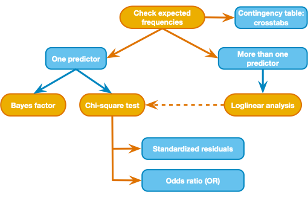

```{r setup, include=FALSE}
knitr::opts_chunk$set(echo = TRUE)
knitr::opts_knit$set(root.dir = rprojroot::find_rstudio_root_file())
library(tidyverse)
```

## General process to analyze categorical outcomes with categorical predictors  
image here: ""

## Step 0 - Install a package  
- This activity makes use of two new packages: "janitor" (for data cleaning), and "vcd" (for odds ratio calculation)  

## Step 1 - Import the data   
- we make use of the "janitor" package in this doc  
- allow "na" and "n/a" as missing values  
- create unique id for reach row  
```{r import}
pub_tib <- readr::read_delim("data/Dataset-PublicationStatistics-2022.tsv",
                           na=c("n/a","na","N/A","NA","Na","N/a",""), delim = "\t",
                           show_col_types = FALSE) %>% 
  janitor::clean_names() %>%  #fixes the column names
  janitor::remove_empty(which = "rows") %>%  # drop empty rows
  mutate(id = row_number(), .before = 1) %>%   #add a column with id for each row
  mutate(across(where(is.character), str_trim)) %>% #remove trailing/leading whitespace 
  mutate(across(where(is.character), tolower)) %>% #make all text columns lowercase 
  select(-student_name,-citation,-doi) #drop columns that we won't use here
```

## Step 2 - clean the data and set variable types
Check values of our variables:  
    1. binary variables (reported yes/no): store as factor and check levels  
    2. numerical (e.g., participants): convert "no" to NA and store as numerical  
    3. field: since one entry can belong to multiple fields, we create a series of dummy coded variables `soc`,`cog`,`dev`, etc where a row gets a value of 1 if the given field appears in the `field` column. there is some variance in how fields are entered ("social"/"soc", "cognitive"/"cog) so we'll just check for a key part of text for each.  
    4. sample\_size\_justification: store as factor and check levels  
    
```{r clean-data}
#fix typos where "no" was entered as "on"
pub_tib <- pub_tib %>% mutate(
  income_or_ses_reported = str_replace(income_or_ses_reported, pattern = "on", replacement = "no")
)

#1. binary variables - using "factor" instead of "as_factor" because it will put
#   the levels in alpha order - NA values are recoded as "no"
pub_tib <- pub_tib %>% mutate(
  race_ethn_reported = factor(replace_na(race_ethn_reported,"no")),
  income_or_ses_reported = factor(replace_na(income_or_ses_reported,"no")),
  location_reported = factor(replace_na(location_reported,"no")),
  general_sample = factor(replace_na(general_sample,"no")),
  sample_size_justification = factor(sample_size_justification)
)
pub_tib %>% select(race_ethn_reported:general_sample,sample_size_justification) %>% purrr::map(levels)
pub_tib %>% count(race_ethn_reported)
pub_tib %>% count(income_or_ses_reported)
pub_tib %>% count(location_reported)
pub_tib %>% count(general_sample)
pub_tib %>% count(sample_size_justification)


#2. Numerical variables: participants_male and participants_female are stored as chr
#   use parse_number() and any non-numeric values will get NA 
#   but there's an inconsistency in reporting NA/no versus 0 - we would need to 
#   resolve the inconsistency to make use of that data
pub_tib <- pub_tib %>% mutate(
  participants_male = parse_number(participants_male, na = "no"),
  participants_female = parse_number(participants_female, na = "no"),
  participants_nonbin = parse_number(participants_nonbin, na = "no")
) 
pub_tib %>% select(participants_n:participants_nonbin) %>% psych::describe()
#3. check out "field"
pub_tib %>% count(field)  #or use janitor::tabyl(field)
# now dummy code the "field" variable, allowing for multiple fields per entry
pub_tib <- pub_tib %>% 
  mutate(
    soc = if_else(str_detect(field,"soc"), 1, 0),
    cog = if_else(str_detect(field,"cog"), 1, 0),
    dev = if_else(str_detect(field,"dev"), 1, 0),
    pers = if_else(str_detect(field,"pers"), 1, 0),
    conbeh = if_else(str_detect(field,"con"), 1, 0),
    neuro = if_else(str_detect(field,"neuro"), 1, 0),
    quant = if_else(str_detect(field,"quant"), 1, 0),
    other = if_else(str_detect(field,"other"), 1, 0),
    #field_combo = ""
  )
# print counts of each field
pub_tib %>% select(soc:other) %>% colSums(na.rm = TRUE)
# no quant cases so drop that column
pub_tib <- pub_tib %>% select(-quant)

```
## Step 3 - Chi-square test of independence and loglinear analysis  
We can discuss what questions to ask with the data and we can explore as much as we have time for. But let's start with an example that makes use of a contingency table and the chi square test of independence:   

#### Question 1 (chi square test): If a study uses a sample that is meant to represent the general population, is race/ethnicity more likely to be reported?    
- we can test whether `general_sample` and `race_ethn_reported` are related  
    - H<sub>0</sub>: `general_sample` and `race_ethn_reported` are independent
    
1. Generate contingency table    
2. Examine observed frequencies compared to expected frequencies   
3. Chi-squared test of independence  
4. if expected frequency for a cell is 5 or less then use Fisher's exact test  

```{r Q1, fig.show='hold', results='hold'}
# 1. Contingency Table
q1_xtab <- pub_tib %>% 
  with(gmodels::CrossTable(general_sample, race_ethn_reported, expected = TRUE,
                       prop.chisq = TRUE)) #use fisher=TRUE if expected counts <5
# 2. Cramers V (round to 3 decimals)
cat("Cramer's V: ", round(DescTools::CramerV(q1_xtab$t),3), "\n")
# 3. Extra: odds ratio
q1_odds <- vcd::oddsratio(q1_xtab$t, log=FALSE)
cat("odds ratio general_sample and race_ethn_reported")
q1_odds  #interpretation: a general sample publication is YY as likely to report race/ethn than a non-general sample publication
confint(q1_odds) #confidence interval
```

##### Understand the output  
1. total observations - 216 means all cases were included  

2. *N* is the observed joint frequency. For example, out of [how many?] samples that represent the general population, [how many?] of those papers reported race/ethnicity.  
3. *Expected N* is the expected joint frequency.  
4. *Chi-square contribution* measures the amount that a cell contributes to the overall chi-square statistic for the table (the sum of all contributions equals the overall chi-squared value below the table).   
  
##### Answer the following  
1. Are any of the expected counts less than or equal to 5?  
2. Are the observed deviations from expected frequencies likely under the null hypothesis? (χ<sup>2</sup>(1, N = 216) = 13.704, p<.0001).  
3. Examine the observed and expected frequencies. What direction is the association between the categories?  
4. What is the effect size? (Cramers V, odds ratio)  

#### Using the last example as a template, let's ask whether research field and race/ethnicity reporting are related.  
- each publication can only be classified as one field, so we will limit our cases to those that are classified as a single field  
- even after limiting cases, there are multiple categories of research field this time (but that's okay)  

```{r Q1followup, fig.show='hold', results='hold'}
# 0. filter cases to keep only single field pubs
pub_tib <- pub_tib %>% rowwise() %>% 
  mutate(
    issinglefield = if_else(sum(c_across(soc:other))==1,1,0),
  ) %>% ungroup()
pub_singlefield_tib <- pub_tib %>% filter(issinglefield==1) %>% 
  mutate(
    singlefield = case_when(
      soc == 1 ~ "soc",
      cog == 1 ~ "cog",
      dev == 1 ~ "dev",
      neuro == 1 ~ "neuro",
      pers == 1 ~ "pers",
      conbeh == 1 ~ "conbeh",
      other == 1 ~ "other"
    )
  )
pub_singlefield_tib %>% count(singlefield)

# 1. Contingency Table
fieldxrace_xtab <- pub_singlefield_tib %>% 
  with(gmodels::CrossTable(singlefield, race_ethn_reported, expected = TRUE,
                       prop.chisq = TRUE, fisher=TRUE)) #if expected counts <5
# 2. Cramers V (round to 3 decimals)

# 3. Interpretation
```


#### Question 2 (loglinear model): Are reporting of race/ethn, income, and location related?  
- we can test whether `race_ethn_reported`, `income_or_ses_reported`, and `location_reported` are related
    - H<sub>0</sub>: the variables are independent
    
1. Generate contingency table    
2. Convert to dataframe of frequencies  
3. Fit loglin model  
4. Compare observed to fitted (predicted) frequencies  
5. Backward elimination (reduce the model)  
6. Visualize  


```{r Q2, fig.show='hold', results='hold'}
# 1. Contingency table (2x2x2)
q2_xtab <- pub_tib %>% 
  xtabs(formula = ~income_or_ses_reported + location_reported + race_ethn_reported)
q2_xtab
#  Flatten table for display
ftable(q2_xtab, row.vars = c("race_ethn_reported","income_or_ses_reported"))
# 2. convert to dataframe of frequencies
q2_xtab.df <- as.data.frame(as.table(q2_xtab))
#set reference level to no (-4 means leave out the 4th columnn for this computation)
q2_xtab.df[,-4] <- lapply(q2_xtab.df[,-4], relevel, ref = "no")
# 3. Fit a loglinear model, using glm(), start with full model
q2_llmodfull <- glm(
  Freq ~ income_or_ses_reported * location_reported * race_ethn_reported,
  data = q2_xtab.df, family = poisson)
summary(q2_llmodfull)
#drop the 3-way term and compare to full "^2" is shorthand for all 2nd order interactions  
q2_llmod2 <- glm(
  Freq ~ (income_or_ses_reported + location_reported + race_ethn_reported)^2,
  data = q2_xtab.df, family = poisson)
summary(q2_llmod2)
anova(q2_llmod2,q2_llmodfull)
#chisq lookup
pchisq(anova(q2_llmod2,q2_llmodfull)$Deviance[2], df = 1, lower.tail = F) #df=2 in example?
# drop another term, drop race:income, then compare to previous model
q2_llmod3 <- glm(
  Freq ~ income_or_ses_reported + location_reported + race_ethn_reported + 
    income_or_ses_reported:location_reported + location_reported:race_ethn_reported,
  data = q2_xtab.df, family = poisson)
summary(q2_llmod3)
anova(q2_llmod3,q2_llmod2)
#chisq lookup based on chisq from the anova output
pchisq(anova(q2_llmod2,q2_llmodfull)$Deviance[2], df = 1, lower.tail = F)
# no significant difference when we dropped race:income, so leave it out of the model
# now drop location:race, compare to the previous model
q2_llmod4 <- glm(
  Freq ~ income_or_ses_reported + location_reported + race_ethn_reported + 
    income_or_ses_reported:location_reported,
  data = q2_xtab.df, family = poisson)
summary(q2_llmod4)
anova(q2_llmod4,q2_llmod3)
#chisq lookup
pchisq(anova(q2_llmod4,q2_llmod3)$Deviance[2], df = 1, lower.tail = F)
# we see that dropping the location:race term has a significant effect, so we keep it in
# and then check the effect of dropping the last 2-way term, drop income:location
q2_llmod5 <- glm(
  Freq ~ income_or_ses_reported + location_reported + race_ethn_reported + location_reported:race_ethn_reported,
  data = q2_xtab.df, family = poisson)
summary(q2_llmod5)
anova(q2_llmod5,q2_llmod3)
#chisq lookup
pchisq(anova(q2_llmod5,q2_llmod3)$Deviance[2], df = 1, lower.tail = F)
# we see that dropping the income:location term has a significant effect, so we keep it in and our final model is q2_llmod3, which included the single terms + location:race + location:income
# 4. compare the fitted values to the observed values. Need to combine the original data with the fitted values.
cbind(q2_llmod3$data, fitted(q2_llmod3)) %>% 
  kableExtra::kbl() %>% kableExtra::kable_classic(lightable_options = "hover")
#exponentiate a coefficient to get odds (compared to reference value of "no")
exp(coef(q2_llmod3))
#alternatively you can just run a chi-sq analysis on the 2x2 with (1) income and location, and (2) race and location, which were the two-way terms that we kept in the model
#5. Visualize
q2_propxtab <- prop.table(q2_xtab,1)
q2_propxtab.df <- as.data.frame(q2_propxtab)
q2_propxtab.df %>% ggplot(aes(x=race_ethn_reported, 
                              y=Freq, fill=income_or_ses_reported)) +
  geom_col(position = "dodge") + 
  facet_wrap(~location_reported, labeller = "label_both")
```

##### Answer the following  
1. What is the simplest model that does not differ significantly from the full model?  
2. How can we interpret this result?    

## Step 4 - export data files and re-run analyses in SPSS  
```{r data-export}
pub_tib %>% 
  mutate(
    race_ethn_reported = as.numeric(race_ethn_reported)-1, #factor levels are 1=no, 2=yes
    income_or_ses_reported = as.numeric(income_or_ses_reported)-1, #so we subtract 1
    location_reported = as.numeric(location_reported)-1    #to end up with 0, 1 values
  ) %>% 
  readr::write_csv("data/collab_data_cleaned.csv")
```

#### Step 4.1 - Question 1  
Test whether `general_sample` and `race_ethn_reported` are related.

1. Analyze -\> Descriptive Statistics -\> Crosstabs  
    - rows: `general_sample`  
    - columns: `race_ethn_reported`  
    - Statistics: Chi Square, Cramer's V  
    - Cells: Observed & Expected counts, Percentages, Standardized Residuals, compare column proportions, adjust p-values 

2. Example odds ratio computation  
    - odds ratio =  (odds of reporting race for general sample)/(odds of reporting race for non-general sample)  
    - odds of reporting race for general sample = [(number of general reported)/(number general not-reported)  
    - odds of reporting race for non-general sample = [(number of non-general reported)/(number non-general not-reported)  
    - odds ratio = [(47/105)/(37/27)] = .3266  
    - reciprocal is 1/.3266 =  3.06  (3.1 times more likely to report race/eth if sample is NOT general)   
    
#### Step 4.2 - Question 2  
- test whether `race_ethn_reported`, `income_or_ses_reported`, and `location_reported` are related

1. Check contingency table with Crosstabs (like above)  
    - row = `income_or_ses_reported`  
    - column = `location_reported`  
    - layer = `race_ethn_reported`  
2. To understand the associations, run two chi squared procedure on the 2x2s that remained: income:location, and race:location.   