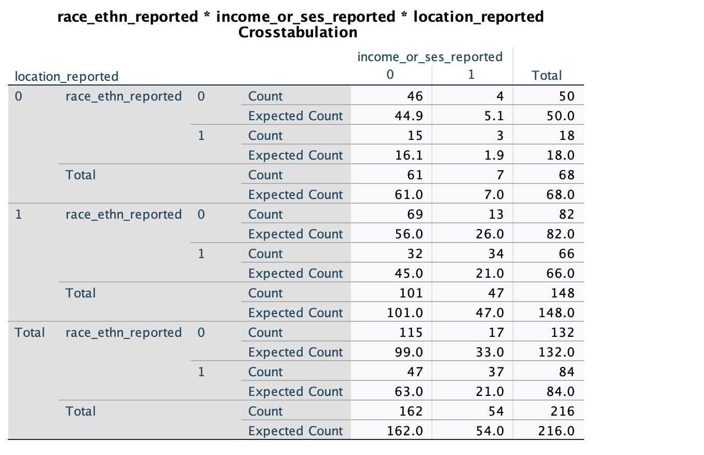
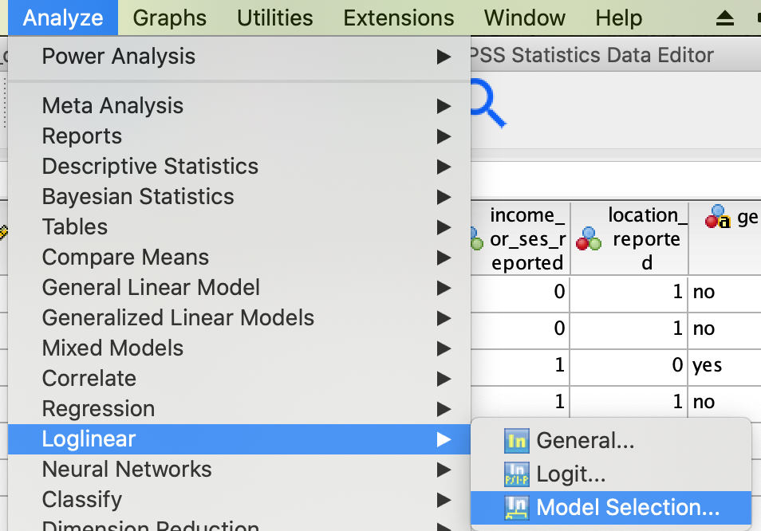
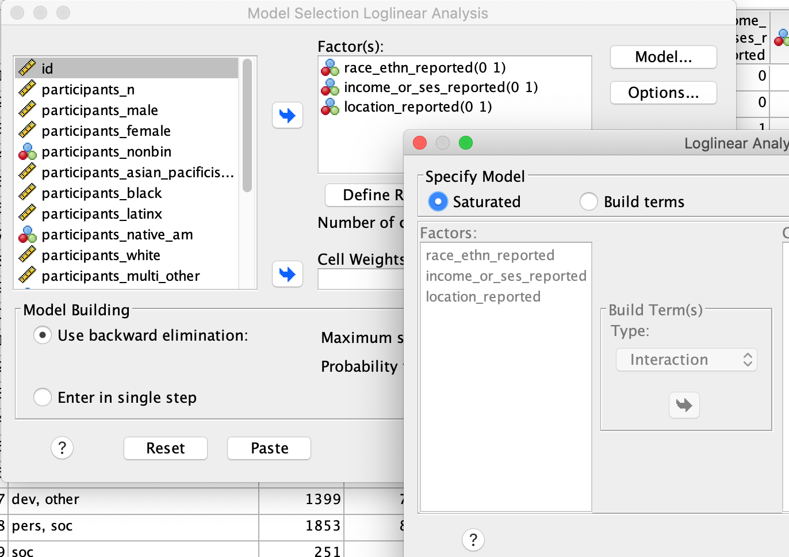
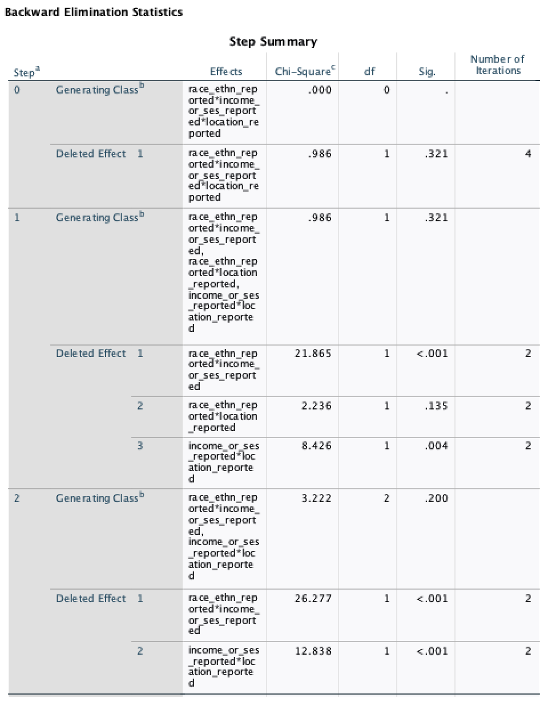
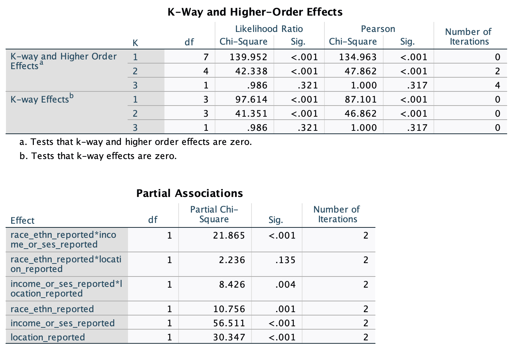
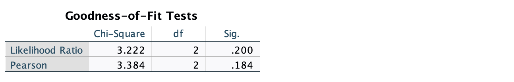
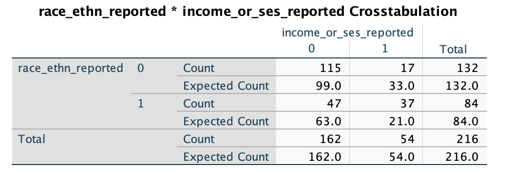
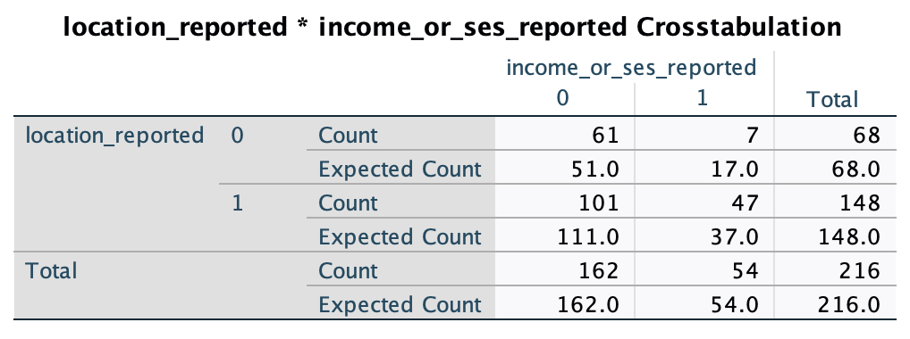

# Log linear modeling in SPSS  
*updated Nov 23, 2022*  

## in-class activity using the collaborative dataset describing reporting in publications  

We start with a data file *[collab\_data\_cleaned.csv](../data/collab_data_cleaned.csv)* that was created from within the R markdown file *[chisq-inclass2022.Rmd](../data/chisq-inclass2022.Rmd)*.  

### General process to analyze categorical outcomes with categorical predictors  
"

### Are reporting of race/ethn, income, and location related?    

- `race_ethn_reported`, `income_or_ses_reported`, and `location_reported` are categorical/nominal variables, each with two levels (0=no,1=yes)
    - H0: the variables are independent  
- with more than two categorical variables, we use a log linear analysis, here are the steps we will take:  
    1. Use Crosstabs to generate contingency table.  
    2. Test whether `race_ethn_reported`, `income_or_ses_reported`, and `location_reported` are related, using Analyze, Log Linear, Model Selection  
    3. Backward elimination: Loglinear analysis is hierarchical: the initial model contains all main effects and interactions. 
Starting with the highest-order interaction, terms are removed to see whether their removal significantly affects the fit of the model. If it does then this term is not removed and all lower-order effects are ignored.  
    4. Look at the table labelled K-Way and Higher-Order Effects to see which effects have been retained in the final model.  
    5. Then look at the table labelled Partial Associations to see the individual significance of the retained effects (look at the column labelled Sig. – values less than 0.05 indicate significance).  
    6. Look at the Goodness-of-Fit Tests for the final model: if this model is a good fit of the data then this statistic should be ***non-significant*** (Sig. should be bigger than 0.05).  
    7. Look at the contingency table to interpret any significant effects.  
*these steps are quoted from the Field textbook, Chapter 19, section 19.12*   

### Step 1. Generate a frequency table using Crosstabs  
- Go to Analyze -> Descriptives -> Crosstabs  
- Enter `race_ethn_reported` in rows  
- Enter `income_or_ses_reported` in columns  
- Enter `location_reported` in layers  
You should get a frequency table like this:  
  
- All of the expected cell frequencies are at least 5, so we proceed  

### Step 2. Analyze -> Log Linear -> Model Selection  

  

**Enter the 3 variables into the "Factors" box**, and use the "Define Range" button to define the range for each (minimum=0, maximum=1) 

  

- "backward elimination" is selected by default, and the Saturated (full model) model is specified by default  

### Step 3. Backward Elimination  
- Look for the "Backward Elimination Statistics" table (screenshot below)  
  

- Notice the following:  
    1. "Step 0 - Generating Class" this is the saturated model. 8 model terms and there are 8 cells so it fits the data perfectly  
    2. "Step 0 - Deleted Effect 1" When the 3-way interaction is removed from the saturated model, the change statistic tells us if model fit was significantly reduced. It is not, χ2(1) = .986, p = .321, so we continue and start removing 2nd order terms (two-way interactions in Step 1)  
    3. "Step 1 - Generating Class" this is the model without the 3-way interaction.  
    4. "Step 1 - Deleted Effect (1, 2, and 3) - each two-way interaction is deleted and compared to the Step 1 model (with all the 2-way interactions)  
    5. There is no significant change when race\*location is deleted, but there is significant change when other terms are deleted, so we remove race\*location and keep the other terms in our "Step 2" model.  
    6. The "Step 2" model is now our standard for comparison and the remaining two-way interactions are deleted in turn. We see a significant change when either is deleted, so we stop here. The "step 2" model (race + income + location + race\*income + location\*income + constant) is our final model.  

### Steps 4 and 5. Look at K-way and Higher-order effects table and the Partial Associations table   

  

- the "K-way..." table shows us that removing the 3 way interaction gives a nonsignificant change in fit (we could also see this in the backward elimination table)  
- the Partial Associations table gives us significance tests for 1st and 2nd order terms in the model. as we saw in the backward elimination table, the race\*location term is not significant  

### Step 6. Look at Goodness of Fit for the final model  

  

- Look at the Likelihood Ratio and Sig. value. The ***non-significant*** test indicates that the model is a good fit of the data- indicating essentially that the frequencies predicted by the final model do not significantly differ from the observed freqencies.  

### Step 7. Look at 2-way contingency tables to interpret significant effects.  
- We generate 2-way contingency tables to understand the two-way associations. Expected freqencies in these tables are what we would expect under the null hypothesis (whereas expected freqencies in the loglinear analysis "Cell counts and Residuals" table - not included here - are expected frequencies predicted by the final model). Select the Chi-square and Risk Estimate options under "Statistics" to get the chi-square stat and odds ratios for these associations (included in the reporting section below)  

1. Race reporting\*Income reporting: we can see in the table that race is reported more than expected (under the null hypothesis) when income is reported (observed N=37, expected N = 21) and less when income is not reported (observed N=47, expected N = 63).  
  

2. Income reporting\*Location reporting: we can see in the table that income/ses is reported more than expected (under the null hypothesis) when location is reported (observed N=47, expected N = 37) and less when income is not reported (observed N=101, expected N = 111).  
  

### Reporting - how to report a finding like this:  
1. report the likelihood ratio statistic for the final
model. 
2. For any terms that are significant you should report the chi-square change. 
3. If you break down any higher-order interactions in subsequent analyses then report the relevant chi-square statistics (and odds ratios). 

For this example we could report:  
The three-way loglinear analysis produced a final model that retained interactions of (a) race reporting by income/ses reporting and (b) location reporting by income/ses reporting. The likelihood ratio of this final model was χ2(2) = 3.222, p = .200, indicating the model did not significantly differ from the observed frequencies. The highest-order interaction (race reporting by income/ses reporting by location reporting) was not significant, (comparison of model without the three-way interaction to the full model: χ2(1) = 0.986, p = .320), and the race/ethnicity-reported by location-reported interaction was not significant (model without this term compared to model with all 2nd-order interactions: χ2(1) = 2.236, p = .135). To understand the two-ways associations, separate chi-square tests were performed to examine (a) race/ethnicity reporting by income/ses reporting (combining location reporting categories) and (b) location reporting by income/ses reporting (combining race/ethnicity reporting categories). There was a significant association between race/ethnicity-reported and whether location was reported, χ2(1) = 24.961, p < .0001, odds ratio = 5.325. Furthermore, there was a significant association between income/ses-reported and whether location was reported, χ2(1) = 11.447, p = .001, odds ratio = 4.055. [plots/contingency tables can be used to characterize the two-way associations completely]    

That's all for today!!!  

### References  
- Chapter 19 of Field textbook: Field, A.P. (2018). Discovering Statistics Using IBM SPSS Statistics. 5th Edition. London: Sage.   

 

