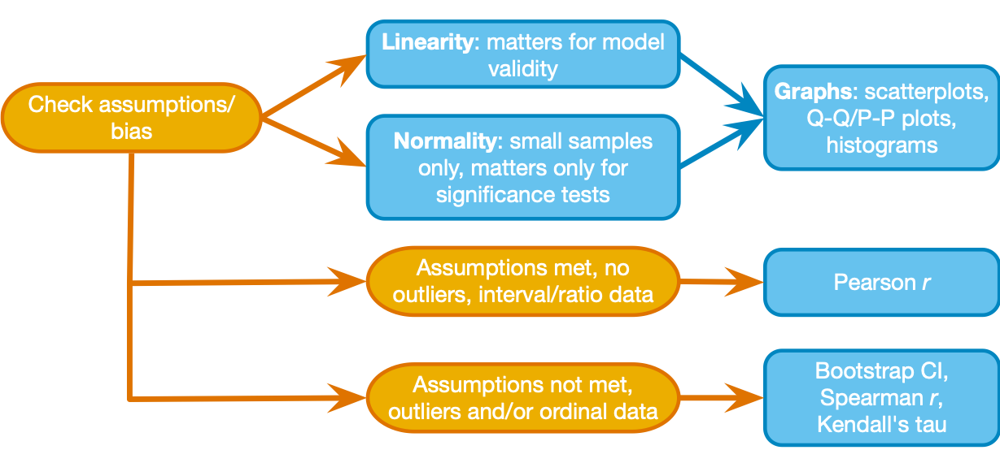

## Learning Objectives

-   Use the decision process depicted in the Field textbook to choose a measure of association between two variables:  

    -   continuous variables, linearity and normality assumed, no outlier issues: ***Pearson's r***  
    -   ordinal or continuous variables, assumption violations and outliers okay:  
        -   if ties in ranking are not a concern: ***Spearman's rho***  
        -   if ties in ranking are a concern: ***Kendall's tau***  
    -   nominal variables: ***Contingency coefficients or Cramer's V***  

-   Measuring associations with more than two variables:  

    -   Partial, Semi-partial correlation, "third variable" issues  
    -   The rest will come in the class meeting on multiple regression  

-   Extra Time: same correlation coefficient, different associations

------------------------------------------------------------------------

## Step 1 - Get organized  

-   make a folder for today's activity  

-   make a "data" folder (inside the project folder)  

    -   **Download the data file [lumos_subset.csv](../data/lumos_subset.csv)** and place it in your "data" folder  

-   make an "spss" folder (inside the project folder)  

    -   save your spss files 

------------------------------------------------------------------------

## Step 2 - Import data  

*data description:*  
This is subset of a public dataset of Lumosity (a cognitive training website) user performance data. You can find the publication associated with this data here:  
[Guerra-Carrillo, B., Katovich, K., & Bunge, S. A. (2017). Does higher education hone cognitive functioning and learning efficacy? Findings from a large and diverse sample. PloS one, 12(8), e0182276. https://doi.org/10.1371/journal.pone.0182276](https://doi.org/10.1371/journal.pone.0182276)

  - this data subset includes only the arithmetic reasoning test (AR) score from a post-test at the end of a 100 day training program (`raw_score`)  
  - `pretest_score` (test at start of the training program) has been transformed to have a mean of 100 and standard deviation of 15 (this is a typical transformation for IQ scores)  
  - other variables are described below as needed  

**Import the data:** Open SPSS and use File -\> Import Data-\> CSV or Text Data  - now check the variable types and add labels if you wish. **Careful! If you use "import text data" make sure you set the delimiter as "comma"** (SPSS may automatically also treat "space" as a delimiter)    

**What to do next:**  

- look at the format of the data file - each row has all measures for 1 individual ("ID" is the unique identifier)  
- set data types for columns as needed (gender, as nominal, ...)    

## Step 3 - Pearson correlation  

#### Let's examine the association between pre-test performance (`pretest_score`) and post-test performance (`raw_score`) -- they should be related, right?  

##### Step 3.1 - First take a look at the decision chart above (Fig 8.6 from the Field textbook). We will start by taking a quick look at the distributions for `raw_score` and `pretest_score`, then we'll make a scatter of them together   

1.  Select only cases that have valid scores (greater than or equal to zero) for for both `raw_score` and `pretest_score` (use Select Cases - you should find that all rows have valid scores)
2.  Make a histogram, bar plot, and Q-Q plot for each variable (like we did in week #2 - use Analyze-\>Descriptives-\>Explore (select "Normality Plots" and "histogram")         
        - are the measures distributed (approximately) normally? Consider the shape of the histogram, the number and location of outliers, and the distance of points on the Q-Q Plot from the diagonal.  
        - you may notice that the Statistical "Tests of Normality" give significant statistics, suggesting that the distributions significantly deviate from a normal distribution. But as noted in the Field textbook, any large sample (like this) is likely to give you a significant statistic even when the deviation from normality is minor. It is more important to look at the plots to assess the distribution.  
3.  Now make a scatterplot with `pretest_score` on the x-axis and `raw_score` on the y-axis  
        - use the Chart Builder (or any method you prefer)  
        - does the association appear linear? (we'll talk about this idea in discussion)  

In the plots for both variables can see that they are approximately normally distributed, anyways we have a large sample (1000 observations) so, as stated in the decision chart above, we are not concerned. We should, however, pay attention to extreme values (outliers) that may have an overly strong influence on the correlation (these are often called high leverage outliers) and violate our linearity assumption - the scatter plot shows that the outliers fit the overall linear pattern.  

##### Step 3.2 - Now that we are satisfied with the assumptions, compute a Pearson correlation coefficient, confidence interval, and null hypothesis test p-value (use a two-sided test).  

  -  Analyze-\>Correlate-\>Bivariate. Select the two variables, and check Pearson and two-tailed significance test.  

What is the Pearson Correlation coefficient between  `pretest_score` and `raw_score`? This is one measure of effect size (referred to as the correlation coefficient "r"). It can range between -1 to 1. The positive value indicates that individuals with a relatively high `pretest_score` tend to also have a relatively high `raw_score`.  

Based on the p-value you got ("p\<.001") for the null hypothesis test, which statement below is true? (assume that this dataset is a random sample of the population of Lumosity users)  
  a. there is a greater than 99.9% probability that the true population correlation between raw_score and pretest_score is non-zero  
  b. there is less than .1% probability that raw_score and pretest_score are uncorrelated 
  c. there is less than .1% probability of finding a correlation at least this extreme (in a sample this size) if the true population correlation is zero  

**NOTE:** With large samples, correlation p-values are not often useful, because even trivially small correlations are significant. The effect size (the pearson correlation coefficient, r, in this case) is generally what you would care about.  
**NOTE \#2:** The scatter plot doesn't seem to show 1,000 points, right? That is because many data points are right on top of each other (there are only 38 unique values of raw_score).  

------------------------------------------------------------------------

## Step 4 - Non-parametric correlation coefficients: Spearman's rho & Kendall's tau  
-   Let's ask a new question about the data: `gametime_prior` is the amount of time an individual spent on Lumosity before **what is the correlation between `pretest_score` and `gametime_prior`?**  
-   You already looked at the `pretest_score` distribution, so now check the `gametime_prior` distribution and make a scatter plot of `pretest_score` vs `gametime_prior`-- what do you notice?  
-   `gametime_prior`is not normally distributed, and there are some extreme values that may have a strong influence on the association, so the linearity and normality assumptions are not met. We should use a non-parametric measure of association, the *Spearman rank correlation coefficient*, to measure the association between these variables:  

##### Step 4.1 -   Compute the Spearman rank correlation coefficient, *rho* or *ρ*, with confidence interval, and null hypothesis test p-value (use a two-sided test).  
- Use the same Analyze-\>Correlate-\>Bivariate menu option but change the selection to "spearman"  
- For comparison, also run the Pearson correlation    
- Now let's take a moment and think about the Spearman Rank correlation coefficient. It is computed by ranking the cases.  
- This means that some cases will have ranks that are tied, and if there are a lot of ties then the rank correlation needs a correction - the Kendall correlation coefficient is a variant of the Spearman that corrects for ties  
- So next, compute the Kendall correlation coefficient. Use the same Analyze-\>Correlate-\>Bivariate menu option but change the selection to "kendall tau b"  
- Compare the correlation coefficient values (spearman, pearson, kendall) and p-values -- what do you notice?  
- *Note about effect size: the pearson r, spearman rho, and kendall tau are all measures of effect size*  

## Step 5 - Categorical (nominal) variables: contingency coefficients

Sometimes we want to look at associations between nominal variables, but we can't use the above methods because one or more variables is not ordinal. In this lumosity data set let's say we want to know whether the non-native English speakers that use the website tend to have a different level of education (than native English speakers).  
##### Step 5.1 - So let's look at the association between the `edu_cat`  and the `english_nativelang` variables  
- `edu_cat` describes level of education as one of 4 categories: high school, college, postcollege, or unspecified  
- `english_nativelang` is whether the user is a native English speaker: yes, no, or unspecified
- Examining this association will tell us whether there are more or less native english speakers at each education level than we would expect if there was no association between the two variables.   
- For this exercise use the Select Cases feature to ignore cases where `edu_cat` or `english_nativelang` is "unspecified" (these "missing values" are a separate issue to consider that we won't address today).  
	- The condition you use for the "If condition is satisified" selection should look like this *(edu_cat ~= "unspecified")  & (english_nativelang ~= "unspecified")* (the "~=" operator means "not equal to")  
	
##### Step 5.2 - Cross-tabulation frequency table  

- A scatter plot is not too useful for categorical variables, so lets make a contingency table to examine the data (Analyze-\>Descriptives-\>Crosstabs).  
   - Set the Row variable as `english_nativelang` and the Column variable as `edu_cat`. 
   - Then click on the "Cells" options and select "Expected" ("Actual" should be automatically selected already).  
   - Then click on the "Statistics" options and select "Chi-square" - this will give use the chi-squared statistic to test the null hypothesis that the two variables are independent of each other.  

- Now let's walk through the output:
  - First, notice the number of total observations in the "Case Processing Summary" - it should tell you that 738 out of the original 1000 cases had values that we can examine in this analysis (meaning values were not "unspecified")  

  - Now look at the Cross tabulation table: The "Count" in each cell is the observed joint frequency. For example, out of 75 users that stated english was not their native language, 33 of them are in the "postcollege" education category. 
  - The "Expected Count" in each cell is the frequency that would be expected if the two variables are independent (i.e., under the null hypothesis).   
  - You can look over every cell, but a general question we can address is whether there is statistical evidence that education level and english as a native language are NOT independent. The chi-squared independence test at the bottom ("Pearson chi square") provides the null hypothesis test. The p-value is the probability of observing deviations from the expected frequencies at least that large if the variables are independent (χ2(2, N = 738) = 11.68, p=.003).  

##### Step 5.3 - Measures of association between nominal variables  
The chi-squared test statistic indicates the association between these two categorical variables, but the scale is hard to interpret. Let's try a couple measures of association, the *contingency coefficient* and an alternative called *Cramer's V*. These measures are each on a 0 to 1 scale, but *Cramer's V* is generally preferred (contingency coefficients cannot reach the max value of 1 in many cases, which makes them hard to compare)  

- use the same "Crosstabs" menu, but this time under the "Statistics" options, select "contingency coefficient" and "Phi and Cramer's V"

- the coefficient and Cramer's V are similar in this case. The values around ~.125 tell us that although the chi-squared test is significant, the strength of the association is rather small (but that's not to say it couldn't be meaningful)  

- *Note about effect size: Cramer's V is a commonly used effect size measure for associations between nominal variables*   

------------------------------------------------------------------------

## Step 6 - Accounting for a third variable: Partial and semi-partial correlation  

Suppose you want to know about the association between age and performance in the training program (`raw_score`), but you want to adjust for their performance level before the training program (`pretest_score`). One way to adjust is with semi-partial and partial correlations. We'll do both here.  

- Let's start by understanding the zero-order correlations (correlations between two variables at a time). First, select all cases, then make a scatter plot for each pair of `age`, `raw_score`, and `pretest_score`, then compute pearson correlation coefficients between each pair of variables (you can enter all three variables at once in the correlation window, and get a table of correlations).      

- We want to examine the relation between `age` and `raw_score`, adjusting (partialling out) for `pretest_score`. Notice that the correlations and scatter plots show us that `pretest_score` shares variance with both (small negative correlation with `age`, and large positive correlation with `raw_score`).  
- The **semi-partial correlation (aka part correlation)** is the association between `age` and `raw_score`, accounting for (i.e., removing shared variance) the association between `age` and `pretest_score` (but not the association between `raw_score` and `pretest_score`).      
- The **partial correlation** is the association between `age` and `raw_score`, accounting for (i.e., removing shared variance) the associations between `age` and `pretest_score` and the association between `raw_score` and `pretest_score`. This can be restated as the unique relationship between `age` and `raw_score` as a proportion of the variance in `raw_score` that is left over when `pretest_score` has been considered (that's a mouthful so we'll try to sum it all up at the end).  
- In SPSS, it's simple to compute the partial correlation. For the semi-partial you need to use the Regression function - so for today we will only compute the partial correlation. See [this vid](https://www.youtube.com/watch?v=6IZCfOKMva0) for an example.    
- Go ahead and compute the partial correlations by using Analyse-\>Correlate-\>Partial, and enter `age` and `raw_score` as the variables, with `pretest_score` as the control variable.    

**What do you notice?**  
- We originally asked whether age was related to performance at the end of the training program. The (small) **zero-order correlation** between `age` and `raw_score` suggested that older individuals scored somewhat lower.  
- But we also saw that there was a (similarly small) correlation between `age` and `pretest_score`, so we decided we should adjust for `pretest_score`. This way we could ask how age uniquely related to post-training performance - that is, when we account for the fact that older adults had lower pretest scores, did older adults perform worse after training?  
- The partial correlation suggested that the association between age and post-training performance was explained by pretest scores.  
- See chapter 8 for more on semi-partial and partial correlations.  

#### That's all - move on to the RStudio activity when you are ready!  

------------------------------------------------------------------------
## References:  
Textbook Chapter 8 - Field, A. (2018). Discovering statistics using IBM SPSS statistics. 5th Edition. SAGE Publications.  

Dataset from [Guerra-Carrillo, Katovich, & Bunge (2017). "Does higher education hone cognitive functioning and learning efficacy? Findings from a large and diverse sample." PLoS one, 12(8), e0182276.](https://doi.org/10.1371/journal.pone.0182276). Licensed under [CC-By Attribution 4.0 International](https://osf.io/x7x6w/) by [Belen Guerra-Carrillo](https://osf.io/qc2jf/) and [Bunge Lab](https://osf.io/y74nt/).  

