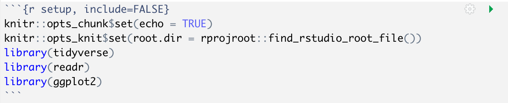

```{r setup, include=FALSE}
knitr::opts_chunk$set(echo = TRUE)
knitr::opts_knit$set(root.dir = rprojroot::find_rstudio_root_file())
library(tidyverse)
library(readr)
library(ggplot2)
```

[Download this file as an R markdown doc](import-examine-instructions-w-code.Rmd)


------------------------------------------------------------------------

## Learning Objectives

-   Set up a project directory and create an R markdown file (\*.Rmd) to document your work

-   Import data from text (csv or tab-delimited)

-   Get descriptives and characterize distributions using simple visuals:

    -   histogram

    -   quantile-quantile plot

    -   box plot

-   Run a normality test (shapiro-wilk)

-   Transform a variable  

-   Reshape a tibble (wide to long and long to wide)  

------------------------------------------------------------------------

## Step 1 - Get organized.

[Video resource (Prof Andy Field) - Working in RStudio](http://milton-the-cat.rocks/learnr/r/r_getting_started/#section-working-in-rstudio) - refer to the video if you want a review

#### 1.1 You already did this for the SPSS activity: Set up a typical project work flow consisting of a project folder containing

-   \*.Rproj file

-   "r_docs" folder to store your lab notes in R markdown

-   "data" folder to store data files for this activity

-   {"images" folder to store plots} - *not needed for most activities*

#### 1.2 Start a new R markdown document to save your work on this activity

-   File->New File->R Markdown
    - name it something sensible
    - default output html (or something else if you prefer but html doesn't require any extra package downloads)
    - now save it in the "r_docs" folder you made for this activity

-   in the "setup" code chunk load these packages with the `library()` function:

    -   tidyverse, readr, ggplot2

-   also in the "setup" chunk, paste in the line below (sets the base folder for code run from your markdown file):

    -   `knitr::opts_knit$set(root.dir = rprojroot::find_rstudio_root_file())`

-   run the setup chunk (click the play button in the top right of the chunk) - this action will load the libraries that will be used below

    -   if you get an error that "there is no package called blahblahblah" then you either have a typo (remember R is case-sensitive), or you need to install the missing package (in the console type, e.g., `install.packages("tidyverse")` )

<button class="btn btn-primary" data-toggle="collapse" data-target="#Block1"> Show/Hide Solution </button>  
<div id="Block1" class="collapse">  

</div>

## Step 2 - Download and import data  

#### 2.1 download these files:  
- ["nhanes_selectvars_n500.csv"](../data/nhanes_selectvars_n500.csv)  
- ["cort-hypothetical.txt"](../data/cort-hypothetical.txt)  
(right-click, save as) and move each to the "data" folder in your project

[NHANES is a large public health dataset](https://www.rdocumentation.org/packages/NHANES/versions/2.1.0/topics/NHANES) - you will work with a small subset of cases and variables.  
The data in "cort-hypothetical.txt" are hypothetical salivary cortisol values (nmol/L) generated for this activity. It is in a tab-delimited format with each line containing ID and cortisol value.  

#### 2.2 Import the data into R  

-   put the code to read the files in a new code chunk (name it "*Step2-load-datasets*" within your markdown file  

-   Use readr::read_csv() to import "data/nhanes_selectvars_n500.csv", store it in a tibble named `nhanes_tib`  

-   Workflow : Insert a "code chunk" into your R markdown doc and put the code there, then **use the "play" button to run chunks of code as you go along**. Don't "knit" the file until you want to see all your work in one html/pdf doc.  

##### Important!!!!  
-   **Don't use the View() function in any of your markdown code chunks**- it will make "knitr" stall when you try to knit your final doc. Instead, just **click on the variable** in your "Environment" tab when you want to look at the data.  

<button class="btn btn-primary" data-toggle="collapse" data-target="#Block2"> Show/Hide Solution </button>  
<div id="Block2" class="collapse">  
```{r Step2-load-datasets, message=FALSE}
nhanes_tib <- readr::read_csv("data/nhanes_selectvars_n500.csv")
```
</div>
  
#### 2.3 Check your column data types  
- the first thing you should do after importing data is make sure each column is the data type that you want   
- you can check data types by clicking on the arrow next to `nhanes_tib` in the Environment tab (top right pane) - or run `str(nhanes_tib)` from the console  
- numeric variables should be "num", and text/string/nominal variables should be "chr" or "Factor" (depending on how you intend to use them) - in this example everything should be fine but in future labs we'll see examples of how to convert types     

## Step 3 - Get descriptives and view the distribution

#### 3.1 Get median, mean, and sd for the variable "Height"
- use `mean()`, `median()`, and `sd()` functions and select the "Height" column. The basic syntax for selecting a column is to use "\$" like this  `mean(nhanes_tib$Height, na.rm = True)` (notice what happens if you leave out "na.rm = True"). To put all the descriptives in a table we will use pipe syntax like you see in the solution below. It's also a good idea to also count cases - use `n()` and `sum(is.na())` -- **EDIT 9/8/2021:** the `n()` function only works within the `dplyr::summarise()` function (see the solution code).   
- Put the code in a code chunk called "*Step3.1-nhanes-height-all*".  
- To organize the stats in a neater way call the same functions from within the `dplyr::summarise()` function (see the solution code below)  

<button class="btn btn-primary" data-toggle="collapse" data-target="#Block3-1"> Show/Hide Solution </button>  
<div id="Block3-1" class="collapse">  
```{r Step3.1-nhanes-height-all, fig.show='hold', results='hold'}
nhanes_tib %>% dplyr::summarise(
  median =  median(Height,na.rm = TRUE),
  mean =  mean(Height,na.rm = TRUE),
  sd = sd(Height,na.rm=TRUE),
  cases = n() - sum(is.na(Height))
  ) %>% 
  knitr::kable(caption = "Height Descriptives- all individuals", digits = 3) %>% 
  kableExtra::kable_styling(full_width = FALSE)
```
</div>

#### 3.1b Now add the confidence interval around the mean to the table, using the function `ggplot2::mean_cl_normal()` (see the solution for how to use it)  

<button class="btn btn-primary" data-toggle="collapse" data-target="#Block3-1b"> Code to add normal 95% confidence interval around mean</button>
<div id="Block3-1b" class="collapse">    
```{r Step3.1b-nhanes-height-all, fig.show='hold', results='hold'}
nhanes_tib %>% dplyr::summarise(
  median =  median(Height,na.rm = TRUE),
  mean =  mean(Height,na.rm = TRUE),
  norm.ci.low = ggplot2::mean_cl_normal(Height)$ymin,
  norm.ci.upp = ggplot2::mean_cl_normal(Height)$ymax,
  sd = sd(Height,na.rm = TRUE),
  cases = n() - sum(is.na(Height))
  ) %>% 
  knitr::kable(caption = "Height Descriptives- all individuals", digits = 3) %>% 
  kableExtra::kable_styling(full_width = FALSE)
```
</div>
  

#### 3.2 Look at the distribution of Height  
*Put your code in the same code chunk that you used for descriptive stats.*

-   Plot a histogram and a boxplot of "Height" using `nhanes_tib %>% drop_na(Height) %>% ggplot( aes(x=Height)) + geom_histogram(binwidth=2)`. Try different values for the binwidth argument to see how it changes the plot. See the solution for extras you can add, like vertical lines for quantiles and mean. 

-   Make a boxplot of "Height" using `nhanes_tib %>% drop_na(Height) %>% ggplot( aes(y=Height)) + geom_boxplot()`

-   Make a quantile-quantile plot of Height. Use `nhanes_tib %>% drop_na(Height) %>%  ggplot( aes(sample=Height)) + geom_qq() + geom_qq_line()` Is Height normally distributed in this sample? Does this Q-Q plot look different from the SPSS one (notice the flipped axis labels)?

-   Describe the distribution shape in your own words. Why does the boxplot show so many outliers at low values? What do you notice about the median and the mean?  

-   Calculate the Shapiro-Wilk statistic for deviation from a normal distribution (use the function shapiro.test() on the Height data). shapiro.test() is an function that doesn't accept a "data" argument, so to use the usual piping syntax, the code is `nhanes_tib  %>% {shapiro.test(.$Height)}` - or alternatively you can use `shapiro.test(nhanes_tib$Height)`.  Although the first example looks unnecessarily complicated, the syntax can be very useful when there are additional piping steps before calling a function.

-   What does the statistic tell you? (and did you already know that from the plots?)  

<button class="btn btn-primary" data-toggle="collapse" data-target="#Block3-2"> Show/Hide Solution </button>  
<div id="Block3-2" class="collapse">  
```{r Step3.2-nhanes-height-all, fig.show='hold', results='hold'}
height_quants <- quantile(nhanes_tib$Height, c(.25,.5,.75), na.rm = TRUE)
height_mean <- mean(nhanes_tib$Height, na.rm = TRUE)
p1 <- nhanes_tib %>% drop_na(Height) %>%
  ggplot( aes(x=Height)) + geom_histogram(binwidth=2) + 
    geom_vline(xintercept = height_quants, colour="red", linetype = "dashed") +
    geom_vline(xintercept = height_mean, colour="black") +
    theme_classic() + labs (title = "Height distribution- all individuals")
p2 <- nhanes_tib %>% drop_na(Height) %>%
    ggplot( aes(y=Height)) + geom_boxplot() + theme_classic() + 
      labs (title = "Height box plot- all individuals")
p3 <- nhanes_tib %>% drop_na(Height) %>%
    ggplot( aes(sample=Height)) + geom_qq() + geom_qq_line() + theme_classic() +
      labs (title = "Height Q-Q- all individuals")
p1; p2; p3
nhanes_tib %>% drop_na(Height) %>% {shapiro.test(.$Height)}
```
</div>

#### 3.3 Filter by Age 
-   Insert a new code chunk (call it *"Step3.3-nhanes-height-adults"*)  

-   Now let's restrict the plots to individuals age 18 or older, make a new descriptives table, histogram, box plot, and q-q plot of height using just those individuals (use the filter() function to select cases, like this: `nhanes_tib %>% filter(Age>=18)`). Then re-calculate the Shapiro-Wilk statistic. 
-   What do the plots tell you? What do you notice about the mean and median?

<button class="btn btn-primary" data-toggle="collapse" data-target="#Block3-4"> Show/Hide Solution </button>  
<div id="Block3-4" class="collapse">  
```{r Step3.3-nhanes-height-adults, fig.show='hold', results='hold'}
# code for table
nhanes_tib %>% filter(Age>=18) %>% dplyr::summarise(
  median =  median(Height,na.rm = TRUE),
  mean =  mean(Height,na.rm = TRUE),
  norm.ci.low = ggplot2::mean_cl_normal(Height)$ymin,
  norm.ci.upp = ggplot2::mean_cl_normal(Height)$ymax,
  sd = sd(Height,na.rm=TRUE),
  cases = n() - sum(is.na(Height))
  ) %>% 
  knitr::kable(caption = "Height Descriptives (Age 18 or older)", digits = 3) %>%
  kableExtra::kable_styling(full_width = FALSE)

#code for histogram
height_quants <- nhanes_tib %>% drop_na(Height) %>% filter(Age>=18) %>%
  {quantile(.$Height, c(.25,.5,.75), na.rm = TRUE)}
height_mean <- nhanes_tib %>% drop_na(Height) %>% filter(Age>=18) %>%
  {mean(.$Height, na.rm = TRUE)}
p1 <- nhanes_tib %>% drop_na(Height) %>% filter(Age>=18) %>%
  ggplot( aes(x=Height)) + geom_histogram(binwidth=2) + 
    geom_vline(xintercept = height_quants, colour="red", linetype = "dashed") +
    geom_vline(xintercept = height_mean, colour="black") +
    theme_classic() + labs (title = "Height distribution- (Age 18 or older)")

#code for boxplot
p2 <- nhanes_tib %>% drop_na(Height) %>% filter(Age>=18) %>%
  ggplot( aes(y=Height)) + geom_boxplot() + theme_classic() + 
    labs (title = "Height box plot- (Age 18 or older)")

#code for Q-Q plot
p3 <- nhanes_tib %>% drop_na(Height) %>% filter(Age>=18) %>%
  ggplot( aes(sample=Height)) + geom_qq() + geom_qq_line() + 
    theme_classic() + labs (title = "Height Q-Q- (Age 18 or older)")
p1; p2; p3
nhanes_tib %>% drop_na(Height) %>% filter(Age>=18) %>% {shapiro.test(.$Height)}
```
  
  
## Step 4 - Applying a mathematical transformation

#### Imagine a subset (N=400) of the NHANES participants gave saliva samples. The lab sent you a file "cort-hypothetical.txt" containing an ID and cortisol measurements on each line, separated by tabs ("\\t").

4.1 Import the text file into a new dataframe/tibble (insert a new code chunk called *"Step4-cort"* ) - note that some values are "qns" which stands for "quantity not sufficient" and should be treated as missing values. Use readr::read_delim() and set the argument "delim" to "\t" (for tab-delimited) and "na" to "qns".  

<button class="btn btn-primary" data-toggle="collapse" data-target="#Block4-1"> Show/Hide Solution </button>  
<div id="Block4-1" class="collapse">  
```{r Step4-cort-partial, message=FALSE} 
cort_tib <- readr::read_delim("data/cort-hypothetical.txt", delim = "\t",na = "qns")
```
</div>
  
4.2 Now check out the distribution of "cortisol_t1" using what you've learned so far.

- Describe the distribution of cortisol_t1 in your notes.

<button class="btn btn-primary" data-toggle="collapse" data-target="#Block4-2"> Show/Hide Solution </button>  
<div id="Block4-2" class="collapse">  
```{r Step4-cort, fig.show='hold', results='hold'}
cort_tib <- readr::read_delim("data/cort-hypothetical.txt", delim = "\t",na = "qns")
cort_tib %>%  dplyr::summarise(
  median =  median(cortisol_t1,na.rm = TRUE),
  mean =  mean(cortisol_t1,na.rm = TRUE),
  norm.ci.low = ggplot2::mean_cl_normal(cortisol_t1)$ymin,
  norm.ci.upp = ggplot2::mean_cl_normal(cortisol_t1)$ymax,
  sd = sd(cortisol_t1,na.rm=TRUE),
  cases = n() - sum(is.na(cortisol_t1))
  ) %>% 
    knitr::kable(caption = "Cort Descriptives", digits = 3) %>% 
    kableExtra::kable_styling(full_width = FALSE)
p1 <- cort_tib %>% drop_na(cortisol_t1) %>%
  ggplot( aes(x=cortisol_t1)) +
    geom_histogram(bins=30) + theme_classic() +
    labs (title = "Cort distribution")
p2 <- cort_tib %>% drop_na(cortisol_t1) %>%
  ggplot( aes(y=cortisol_t1)) + geom_boxplot() + 
    theme_classic() + labs(title = "Cort Box Plot")
p3 <- cort_tib %>% drop_na(cortisol_t1) %>%
  ggplot( aes(sample=cortisol_t1)) + geom_qq() +
    geom_qq_line() + theme_classic() +
    labs(title = "Cort Q-Q Plot")
p1; p2; p3
cort_tib %>% drop_na(cortisol_t1) %>% {shapiro.test(.$cortisol_t1)}
```
</div>
  
  
4.3 Log transformation of a variable can be useful for some measurements with positively skewed distributions, and it is a common practice with salivary cortisol.  

- Use the function "log" to create a new column in your cortisol dataframe, containing the natural logarithm of each `cortisol_t1` measurement - name the new column `logcortisol_1`. Then, describe the distribution of the new `logcortisol_t1` variable.  

<button class="btn btn-primary" data-toggle="collapse" data-target="#Block4-3"> Show/Hide Solution </button>  
<div id="Block4-3" class="collapse">  
```{r Step4.3-log-cort-distribution, fig.show='hold', results='hold'}
cort_tib <- cort_tib %>% mutate(logcortisol_t1=log(cortisol_t1))
cort_tib %>%  dplyr::summarise(
  median =  median(logcortisol_t1,na.rm = TRUE),
  mean =  mean(logcortisol_t1,na.rm = TRUE),
  norm.ci.low = ggplot2::mean_cl_normal(cortisol_t1)$ymin,
  norm.ci.upp = ggplot2::mean_cl_normal(cortisol_t1)$ymax,
  sd = sd(logcortisol_t1,na.rm=TRUE),
  cases = n() - sum(is.na(logcortisol_t1))
  ) %>% 
    knitr::kable(caption = "Log Cort Descriptives", digits = 3) %>% 
    kableExtra::kable_styling(full_width = FALSE)
p1 <- cort_tib %>% drop_na(logcortisol_t1) %>%
  ggplot( aes(x=logcortisol_t1)) +
    geom_histogram(bins=30) + theme_classic() +
    labs (title = "Log Cort distribution")
p2 <- cort_tib %>% drop_na(logcortisol_t1) %>%
  ggplot( aes(y=logcortisol_t1)) + 
    geom_boxplot() + theme_classic() + 
    labs (title = "Log Cort box plot")
p3 <- cort_tib %>% drop_na(logcortisol_t1) %>%
  ggplot( aes(sample=logcortisol_t1)) + 
    geom_qq() + geom_qq_line() + theme_classic()
p1; p2; p3
cort_tib %>% drop_na(logcortisol_t1) %>% 
  {shapiro.test(.$logcortisol_t1)}
```
</div>
  
## Step 5 - Re-structuring data (wide to long and back again)  

-   Did you watch the video about "tidy" data? Would you say that the cortisol data tibble is "tidy" right now (take a look at the tibble by clicking on it in the Environment tab of RStudio)? Assume that cortisol_t1 and cortisol_t2 are the same measure (salivary cortisol) taken at two timepoints.  
-   We will discuss what "tidy" data means when we re-group, but for now let's practice restructuring the data using `pivot_longer()` and `pivot_wider()` (these functions are updated replacements for the `gather()` and `spread()` functions you saw used in the tidy data video)  

#### Step 5.1 - Use `pivot_longer()` to restructure the data to long/tidy format 
 - you should end up with 4 columns: `ID`, `time`, `cortisol`, `logcortisol`, and 2 rows for each ID (for t1 and t2)
 - name the restructured tibble `cort_long_tib`  
 - this very tricky so go ahead and peek at the solution  
 - does the new tibble look the way you expected?  
 - what if you want to save the data in this format? Use `write_delim()` or `write_csv` and output a text document    
 
<button class="btn btn-primary" data-toggle="collapse" data-target="#Block5a"> Show/Hide Solution </button>  
<div id="Block5a" class="collapse">  
```{r Step5a-restructure-longer, fig.show='hold', results='hold'}
# wide to long/tidy
cort_long_tib <- cort_tib %>% 
  pivot_longer(!ID, names_to = c(".value","time"),
               names_sep = "_", values_drop_na = FALSE) 
#.value indicates that component of the name defines the name of the column containing the cell values
head(cort_long_tib)
```
</div>

#### Step 5.2 - Use `pivot_wider()` to restructure the data back to wide format 
- use `cort_long_tib` as the input, and reshape it to a wide format  
- name the restructured tibble `cort_wide_tib`  
- you should end up with 5 columns: `ID`, `cortisol_t1`, `cortisol_t2`, `logcortisol_t1`, and `logcortisol_t2`, 1 row for each ID (all of the `logcortisol_t2` values should be missing)  
- why would you want to change the shape of a dataset like this? we'll talk about some cases in discussion
- check out [this tidyr page](https://tidyr.tidyverse.org/articles/pivot.html) for lots of restructuring examples  

<button class="btn btn-primary" data-toggle="collapse" data-target="#Block5b"> Show/Hide Solution </button>  
<div id="Block5b" class="collapse">  
```{r Step5b-restructure-wider, fig.show='hold', results='hold'}
cort_wide_tib <- cort_long_tib %>% 
  pivot_wider(id_cols = ID, names_from = "time", 
              values_from = c("cortisol","logcortisol"),
              names_sep = "_", values_fill = NULL) 

```
</div>

## That's all for today - help a classmate or try the mini-challenge below if you have more time!  

-   Re-do descriptives and a histogram and boxplot of Height from the NHANES data set, but group by Gender, so that you have 1 histogram plot (where different Genders get color-coded) and 1 boxplot (with Gender on the x-axis). Keep it restricted to Age 18+ only. Do you see any outliers (according to the boxplot threshold), when the data are split by Gender?

-   Hints:

    -   you can use the "fill" argument in `aes()`to map a variable onto the fill color chart component (called an "aesthetic" in ggplot language) - use position="identity" and alpha=.5 so that the histogram bars for different Gender are overlayed (rather than stacked)

    -   you can use the "x" axis argument in aes() to map a variable onto the x-axis (for the boxplot)

-   **Things to pay attention to:** did you see a warning like "Removed {X} rows containing non-finite values" above the plots? What does that mean? How can you adjust your code so that you don't get the warning?

-   Experiment with different settings (position, alpha, theme) if you finish early

<button class="btn btn-primary" data-toggle="collapse" data-target="#Block6"> Show/Hide Solution </button>  
<div id="Block6" class="collapse"> 
```{r Step6-nhanes-height-challenge, fig.show='hold', results='hold'}
nhanes_tib %>% drop_na(Height,Gender) %>% filter(Age>=18) %>% 
    group_by(Gender) %>%  
    dplyr::summarise(
        median =  median(Height,na.rm = TRUE),
        mean =  mean(Height,na.rm = TRUE),
        sd = sd(Height,na.rm=TRUE),
        cases = n()
    ) %>% 
    knitr::kable(caption = "Height Descriptives by Gender (Age 18+)", digits = 3) %>% 
    kableExtra::kable_styling(full_width = FALSE)
p1 <- nhanes_tib  %>% drop_na(Height,Gender) %>% filter(Age>=18) %>%
    ggplot( aes(x=Height, fill=Gender)) + 
        geom_histogram(position="identity",alpha=.5,binwidth=2) + 
        theme_classic() + labs (title = "Height Distribution by Gender (Age 18+")
p2 <- nhanes_tib %>% drop_na(Height,Gender) %>% filter(Age>=18) %>%
    ggplot( aes(y=Height, x=Gender)) + geom_boxplot() + theme_classic() + 
        labs (title = "Height Distribution by Gender")
p1
p2

```
