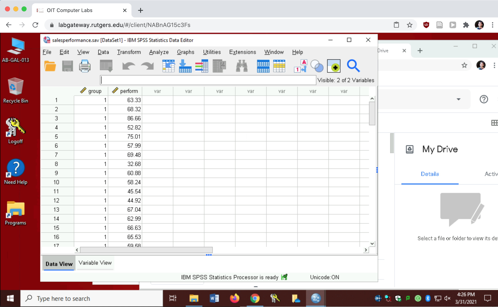
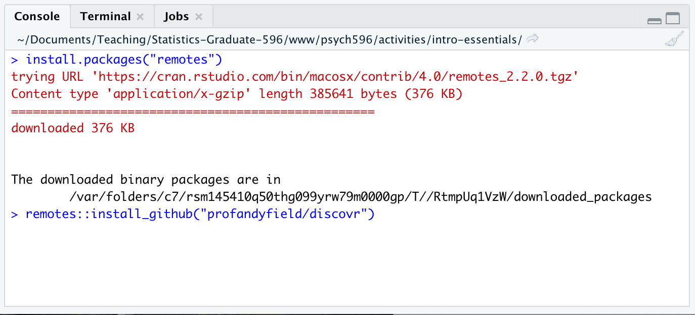
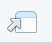

---
output:
  html_document: default
---

## Week 1 - Set up SPSS & R with RStudio

*updated May 26 2022*

### 1. SPSS installation/access

-   if you have access to an SPSS license, great! Follow installation and licensing instructions from wherever you got the license (e.g., [software.rutgers.edu](https://software.rutgers.edu)) - we will be using version 27.0 in class.

-   if you do not have a license you can use Rutgers Virtual Lab to run SPSS inside a browser window

    -   login at [labgateway.rutgers.edu](https://labgateway.rutgers.edu) or [run-labgateway.rutgers.edu](https://run-labgateway.rutgers.edu)\
    -   you will see a Windows Desktop inside your browser window - you can start SPSS by typing "spss" into the start menu bar
    -   *IMPORTANT:* any files you create while using the Virtual Lab will be deleted when you logout or close the window. To save files you need to transfer them to a cloud drive like [box.rutgers.edu](https://it.rutgers.edu/box/) or Google Drive. Transfer files by opening a browser inside the Virtual Computing desktop and going to your preferred cloud account.
    -   a good habit is to open your cloud account right after logging into a Virtual Computing session - then you can save your progress to the cloud as you go. If you are inactive for too long you will be logged out and lose any files that weren't saved to the cloud.
    -   if you are using a Mac touchpad, you can right-click in the virtual session by doing a two-finger tap

#### NEW! - Rutgers has an alternative method to connect to a Virtual Computing Session - see <https://it.rutgers.edu/virtual-computer-labs/knowledgebase/accessing-windows-virtual-desktop/>

*screenshot of a Virtual Computing Session* 

### 2. Install R and RStudio on your computer

R is a statistical programming language. RStudio is a development environment built to make it easier to run, view, and document with the R language. R is open-source, so you can install it on your own

-   if you already have R and Rstudio installed, make sure you have an R version 4 or greater (e.g., 4.0.4), and RStudio 1.4 or greater

    -   to check your R version, run `getRversion()` in the RStudio console
    -   to check your RStudio version use the RStudio -\> About menu item

-   **To install (or update)**: Follow this link to [Garrett Grolemund's online book *Hands on Programming with R*](https://rstudio-education.github.io/hopr/starting.html) to find download links and installation instructions for Mac, Windows, and Linux

### 3. Install essential R packages

-   Much of what we will do in R relies on *packages*, which are openly available extensions to the R programming language. Packages contain functions, data, and documentation that you can use as needed by installing a package and loading it.

-   Right now, we'll install the majority of the packages that we will use this semester. By installing them all now, we will all have similar versions of each package, which will help with troubleshooting throughout the course. If you already have some of these packages installed, you can rerun the install command to (potentially) update the installed version, or you can continue with your environment as is (if you are comfortable managing package versions in your own way).

-   In the *Console* window pane type the following commands below one line at a time, being sure to match upper/lowercase (pay attention to the text output after each command in case there are errors):\
    ***Be sure not to confuse the "Console" with the "Terminal" Pane!!!***

    \> `install.packages("learnr")`\
    \> `install.packages("remotes")`\
    \> `remotes::install_github("profandyfield/discovr")`\
    \> `install.packages("tidyverse")`\
    \> `install.packages("afex")`\
    \> `install.packages("lme4")\
    \> `install.packages("effectsize")`\
    \> `install.packages("correlation")`\
    \> `install.packages("ggfortify")`\
    \> `install.packages("kableExtra")`\
    \> `install.packages("wesanderson")`\

    *screenshot of the Console Pane* 

### 4. Load the first "discovr" tutorial

Go to the Tutorial Pane (top right) and click "start tutorial" for the "discovr: key concepts in R (discovr_01)" tutorial. *it will take a minute to load* - use the "pop-out" button  to open the tutorial in a larger view.

-   If you still have time left in class, go through the first section of the Discovr tutorial. It will be helpful to get familiar with the concepts of objects, functions, data types, assignment ("\<-"), and piping ("%\>%").
