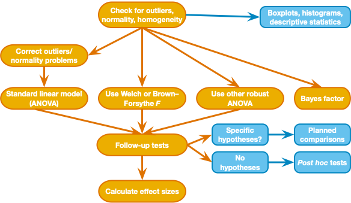

```{r setup, include=FALSE}
knitr::opts_chunk$set(echo = TRUE)
knitr::opts_knit$set(root.dir = rprojroot::find_rstudio_root_file())
library(tidyverse)
library(ggplot2)
```

------------------------------------------------------------------------

## Goals for today  

Learn how to compare means of a continuous outcome from several independent groups to address the effect group on the dependent variable (modeling a continuous DV with a categorical IV). Extend this model to groups that differ on two factors (2x2 design).  

- between subjects ANOVA (1 factor, 3 levels): conduct a one-way analysis of variance (one categorical predictor of a continuous DV) with `lm()` and `anova()` using the default treatment/dummy coding scheme  
    -	Check assumptions (same as GLM)  
    - Understand SS between, SS within, F-stat  
    - Effect size: R-squared for full model, partial	η<sup>2</sup> (eta-squared)  
    - Interpret contrast coefficients  
    - non-parametric alternative: `kruskal.test()` function  
- ANCOVA: add 1 continuous covariate  
    - understand independence of treatment and covariate  
    - understand assumption of homogenous regression slopes  
- Factorial ANOVA (2 factors, 3X2 levels)  
    - use afex package    
    - Simple effects    


## Step 1 - Get organized
- Open RStudio and start a new project, select "Existing Directory" and select the folder you created for this activity    
- **Earlier you downloaded [oveis-2020-recoded-data.csv](../data/oveis-2020-recoded-data.csv)**   
- In RStudio, start a new R markdown and do your work in there, save the file in a subfolder called r_docs  
  - put these lines in your "setup" code chunk:  
  `knitr::opts_chunk$set(echo = TRUE)`   
  `knitr::opts_knit$set(root.dir = rprojroot::find_rstudio_root_file())`   
  `library(tidyverse)`  
  `library(ggplot2)`  

  - run the setup code chunk (the necessary `library()` statements are in there)  
  - run `install.packages("afex")` and `install.packages("emmeans")`in the console if you don't have those packages installed  


------------------------------------------------------------------------

## Step 2 - Import data and check for outliers, normality    

- data description: `oveis-etal-2020.csv` is shared data from the publication [Oveis, C., Gu, Y., Ocampo, J. M., Hangen, E. J., & Jamieson, J. P. (2020). Emotion regulation contagion: Stress reappraisal promotes challenge responses in teammates. Journal of Experimental Psychology: General, 149(11), 2187.](https://doi.org/10.1037/xge0000757) 

  - in this study, participants were randomly assigned to one of six cells in a 3 X 2 factorial design. The explanation here will be brief and we will use simplified labels for the conditions - please refer to the publication for a full study description.
  - DV and covariate:
      1. `card_out_react_prep` - Cardiac output during interaction with a partner (preparing for a marketing pitch about a hypothetical product). Higher cardiac output is thought to represent an interpretation of a stressor as a "challenge" (as opposed to a threat; e.g., [Mendes, et al., 2001](https://doi.org/10.1002/ejsp.80))  
      2. `prepIOS_cent` - closeness rating (mean centered). participants rated how connected they felt to their partner during the interaction (higher values indicate greater connectedness)  
  - IVs: 
      1. Emotion regulation condition (`emoreg_cond`) - participants were randomly assigned to one of three groups: control=no emotion regulation instruction, suppress=instructions to suppress displays of emotion, reappraise=instructions to think about feelings of stress/arousal as a helpful part of their body's response that prepares itself for a challenge  
      2. Instruction Target (`direct_cond`) - participants were randomly assigned to receive the emotion regulation instruction directly ("self" condition) or interact with a partner who received the emotion regulation instruction ("partner" condition - they never receive the instruction directly)  
      
#### Let's get going!  
1. Make a new code chunk and use readr::read_csv() to read in the data. Make sure that NA values are handled the way you want (click on the tibble in the Environment window pane to take a quick look).   
2. Then make sure the columns that contain nominal vals are stored as class factor, using `forcats::as_factor()`, and use `forcats::fct_relevel()` to reorder the levels of `emoreg_cond` so that "control" is level 1, "suppress" is level 2, and "reappraise" is level 3 ( you can verify the level order of a factor by running `levels(emo_tib$emoreg_cond)`)  
    - `emoreg_cond` should be a factor (with 3 levels)  
    - `direct_cond` should be a factor (with 2 levels)  
3. Then get descriptives for the DV `card_out_react_prep` and the covariate `prepIOS_cent`, organized by just the first IV `emoreg_cond` - use `psych::describeBy()` or `dplyr::summarise()`  
    - there are no missing cases in this data (this is a subset of the original dataset) but you should be mindful of missing cases when working with your own data   
    - note: if you choose to use `psych::describeBy()` you will get an error if you only ask for descriptives for a single column (so be sure to send both `card_out_react_prep` and `prepIOS_cent` to the function - see code below)  
4. We are going to start by considering only 1 of the categorical IVs, `emoreg_cond`. Group the data by just this first IV and check the distribution shape (for a normal-ish shape) and potential outliers for the DV (histogram and boxplot)    
    - tip: to split a histogram into a separate plot for each group, use `facet_wrap(~emoreg_cond)` as an added layer to the ggplot code (see example solution)  


<button class="btn btn-primary" data-toggle="collapse" data-target="#step-2"> Show/Hide Solution </button>  
<div id="step-2" class="collapse">  
```{r Step-2-import, fig.show='hold', results='hold', message=FALSE}
# 1. first import the data
emo_tib <- readr::read_csv("data/oveis-2020-recoded-data.csv", na = "NA")
# 2. now make sure the columns we want as factors are treated that way, using forcats::as_factor()
#while you're at it, reorder the levels of 
emo_tib <- emo_tib %>% dplyr::mutate(
  emoreg_cond = forcats::as_factor(emoreg_cond) %>% 
    forcats::fct_relevel("control","suppress","reappraise"),
  direct_cond = forcats::as_factor(direct_cond) 
)

# 3. descriptives by emoreg_cond group
emo_tib %>% select(card_out_react_prep, prepIOS_cent, emoreg_cond) %>%
  psych::describeBy(card_out_react_prep + prepIOS_cent ~ emoreg_cond, data = ., mat = TRUE) %>% 
  knitr::kable(caption = "Cardiac Output and partner closeness by Emotion Regulation Condition", digits = 3) %>% 
  kableExtra::kable_classic(lightable_options = "hover")  

# 4. look at the data
p1 <- emo_tib %>% ggplot( aes(x = card_out_react_prep)) + 
  geom_histogram(position = "identity", bins = 15) +  
  facet_wrap( ~ emoreg_cond) +
  theme_classic()
p1
p2 <- emo_tib %>% ggplot( aes(x = emoreg_cond, y = card_out_react_prep)) + 
  geom_boxplot(position = "identity") +  
  theme_classic()
p2
```
</div> 
&nbsp;

------------------------------------------------------------------------

## Step 3 - ANOVA using `lm()`      

#### Step 3.1: specify the model  
The distributions look normal-ish, and there is a decent sample size, so we can go ahead with the ANOVA model, remembering to examine the model residuals for sources of bias (e.g., extreme values, heteroskedasticity).  
ANOVA and linear regression are both based on the General Linear Model and use the same underlying math, so we will use the same `lm()` function that we used in the regression activity a few weeks ago:  
    1. use the `lm()` function to build a linear model with 1 categorical predictor (`lm(formula= card_out_react_prep ~ emoreg_cond`)), store the model in a variable called `card_lm`  
    2. then use the `anova()` function on the resulting fitted model to partition the variance in the same way we did with SPSS to get the omnibus F-stat
    3. and then we can use `effect_size::eta_squared(model, partial = False, ci = .95)` to get effect size η<sup>2</sup> (eta-squared; since there is only one predictor this is the same as partial η<sup>2</sup>, and the same as the overall R<sup>2</sup> for the model). You could also use `omega_squared()` in place of `eta_squared()`, which is a similar effect size measure that is adjusted to generalize to a population more accurately (it will always be lower than eta-squared).   
Look at the solution below and make it work for you, then let's think about the output.     

<button class="btn btn-primary" data-toggle="collapse" data-target="#step-3a"> Show/Hide Solution </button>  
<div id="step-3a" class="collapse">
```{r Step3a,fig.show='hold', results='hold'}
card_lm <- emo_tib %>% 
  lm(formula = card_out_react_prep ~ emoreg_cond)
anova(card_lm)
effectsize::eta_squared(card_lm, ci = .95, partial = FALSE) %>% 
  kableExtra::kbl(caption = "Effect size", digits = 4) %>% 
  kableExtra::kable_styling(full_width = FALSE)
```
</div>

##### Understanding the output of `anova()`:  
1. The Analysis of Variance Table gives the F-statistic, which is equal to the mean square between groups divided by the mean square within groups. In our regression examples we referred to this value more generally as the ratio of variance explained by the model to leftover error (residual variance).  
2. The p-value for the F-stat tells you the probability of an F-statistic at least that large (mean differences that large) under the null hypothesis that there is no difference between emo_reg group means. When you report the F-stat you include the between and within degrees of freedom like this: F(2,231) = 9.324, p = .0001  
3. The eta-squared (η<sup>2</sup>) effect size can be interpreted as proportion of variance in the DV explained by the model. Since there is only one IV, partial eta-squared for the one predictor is the same as eta-squared. When we talk about an effect of a multilevel factor this is often called the "omnibus effect" to refer to the effect across all levels of the factor.  
4. The F-stat and effect size do not tell you anything about the direction of the group effect, so we need to think more about the model. Let's look at contrasts of our categorical predictor (often referred to as planned contrasts).  

#### Step 3.2 - Planned contrasts  
When we used `lm()` to run a linear regression (a few weeks ago), we examined the output with the `summary()` function rather than the `anova()` function, and it gave us some information about the model (e.g., coefficients for predictors) that we didn't see above in the model description we got from `anova()`. In a code chunk or in your console, run `summary(card_lm)`. You should get something like this:
```{r Step3b, fig.show='hold', results='hold'}
summary(card_lm)
```

##### Notice the following in the output:
  1. The "Multiple R-squared" is the same as the eta-squared effect size you just calculated (proportion of variance explained by the model).  
  2. The overall F-stat and p-value are the same as what you got from the `anova()` function.  
  3. But now you see a Coefficients table with rows for the intercept and 2 predictors (`emoreg_condsuppress` and `emoreg_condreappraise`)  
      - The intercept has the same meaning that it had in our linear regression examples. It is the predicted value of the DV when the values of all predictors are zero. But what does it mean for a categorical predictor to have a value of zero?  
      - The answer is that it depends on how the categorical variable is "coded". To estimate the `lm()` model, R recodes the 3-level categorical variable into 2 numerical columns (always the number of levels minus 1), and uses those numerical "contrasts" as predictors in a linear regression model ( DV = intercept + B<sub>1</sub>(contrast1) + B<sub>2</sub>(contrast2)). By default, R will use a treatment coding scheme (also called dummy coding) where the second level ("suppress") gets a value of 1 in contrast1 (0 in contrast2) and the third level gets a value of 1 in contrast2 (0 in contrast1). Run the command `contrasts(emo_tib$emoreg)` to see how R has coded the categorical variable.  
      - Notice that first level gets a value of 0 in both contrasts and is called the "reference level". This means that the intercept is the mean of the reference level (you can go back to your descriptives above and verify that the mean cardiac output for the "control" group is -.26, same as the intercept in our model output) - this is true because the intercept is the predicted value when the two predictors (contrasts) are both zero.  
      - The two contrasts in the model `summary()` output get named by the factor name and the contrast name put together. The coefficient for each contrast represents (just like in linear regression) the predicted change in DV for a one unit change in the IV. So for contrast1 (emoreg_condsuppress) a one unit change is the difference between the reference level ("control") and the second level ("suppress"). This means that adding the coefficient (.126) to the intercept (-.258) should give you the mean of the "suppress" group (-.132) - the math checks out. Likewise, the coefficient for contrast2 (emoreg_condreappraise) represents the difference between the reference group ("control") and the third level ("reappraise").  
      - The t-value and Pr(>|t|) (p-value) for each contrast have the same meaning as in linear regression, and allow you to make inferences based on the contrasts. The p-value represents the probability of getting a t-stat at least that far from 0 under the null hypothesis that the true contrast coefficient is 0.  
      - So, for contrast1 (emoreg_condsuppress), the p-value of .3398 means it is not surprising to observe a contrast coefficient that far from 0 under the null hypothesis. The contrast represents the difference between "control" and "suppress" groups, so we would fail to reject the null hypothesis that those two groups have the same mean cardiac output in this paradigm.  
      - For contrast2 (emoreg_condreappraise), the p-value of .000048 (4.76e-05) means it is unlikely to observe a contrast coefficient that far from 0 under the null, so we have reason to reject the null hypothesis that the "control" and "reappraise" groups do not differ.  

#### Step 3.3 - other contrast coding schemes  
Notice that the contrasts above don't give us a comparison between "suppress" and "reappraise" groups. In planned contrasts, we are always limited to k-1 contrasts, where k is the number of levels of the categorical predictor. The default ("treatment"/"dummy") coding scheme allows us to test a reference level vs. each other level, but other coding schemes allow us to make other comparisons if they make more sense for our purposes. Check out [this page for an excellent overview of contrast coding](https://stats.idre.ucla.edu/r/library/r-library-contrast-coding-systems-for-categorical-variables/) (from the UCLA Institute for Digital Research and Education) to learn how to use the `contrasts()` function to set contrasts for a categorical variable.  

##### Polynomial contrast coding   
The default treatment/dummy coding scheme makes sense if we hypothesized that both "suppress" and "reappraise" instructions would influence cardiac output. But if the groups were ordered ("control", "suppress", and "reappraise" represent increasing levels of regulation), then we might instead want to test for a linear trend (increasing cardiac output between level 1 and level 3) and quadratic trend (level 2 is lower or higher than the extremes, like a U or inverted U shape) by including a contrast for each. If we had 4 levels we could include a cubic contrast. This contrast coding scheme is referred to as polynomial contrast coding. Use the code below to see how to set the contrasts to test for a linear and quadratic trend (using the `contr.poly() function`).  

<button class="btn btn-primary" data-toggle="collapse" data-target="#step-3c"> Show/Hide Solution </button>  
<div id="step-3c" class="collapse">
```{r Step3c,fig.show='hold', results='hold'}
# set contrasts using contr.poly()
contrasts(emo_tib$emoreg_cond) = contr.poly(3) #3 corresponds to number of levels
# view the contrast coding scheme
contrasts(emo_tib$emoreg_cond)
# re-estimate the model
card_lm <- emo_tib %>% 
  lm(formula = card_out_react_prep ~ emoreg_cond)
# output the model summary
summary(card_lm)
```
</div>

##### Look at the output  
1. The overall model stats have not changed (R-squared, F, p-value are all the same as before)  
2. `emoreg_cond.L` is the linear contrast. The t-stat and low p-value mean that a linear contrast coefficient this far from 0 is unlikely under the null hypothesis that there is no linear (increasing or decreasing) trend in cardiac output across levels of emotion regulation.  
3. `emoreg_cond.Q` is the quadratic contrast. If we had hypothesized that the influence of emotion regulation on cardiac output was U-shaped then we would have expected a significant quadratic contrast coefficient, which is not the case here.  

#### Step 3.4- check assumptions  
We are using the same modeling framework that we used in linear regression, so the assumptions concerning residuals (normality and homogeneity) are the same, and we can check them the same way. Use the `plot()` function to get the default plots of residuals, like we did in the linear regression activity.  
We have a categorical predictor with 3 levels, so you should notice that there are only 3 possible values for model fitted values, which correspond to the 3 group means.  
If you are concerned about assumption violations, particularly homogeneity of variance, you can run the Kruskal-Wallis non-parametric test using `kruskal.test(formula = card_out_react_prep ~ emoreg_cond, data = emo_tib)`. The Kruskal-Wallis test, like other nonparametric tests we have used before, is based on ranking the data.    

<button class="btn btn-primary" data-toggle="collapse" data-target="#step3d"> Show/Hide Solution </button>  
<div id="step3d" class="collapse">  
```{r Step3d,fig.show='hold', results='hold'}
plot(card_lm)
kruskal.test(formula = card_out_react_prep ~ emoreg_cond, data = emo_tib)
```
</div>
&nbsp;

#### Step 3.5 - Now let's describe the key results so far  
How would we write up what we found? Let's focus on the original model with the default treatment coding scheme. We found that there was a significant effect of emotion regulation instruction on cardiac output, and a significant difference between the "reappraise" and "control" conditions, but no significant difference between "control" and "suppress" conditions. We could write that up like this:  

*Emotion regulation condition impacted cardiac output during partner interaction (F(2,231) = 9.324, p = .0001, η<sup>2</sup> = .075). Planned contrasts showed that participants in the reappraisal condition exhibited greater cardiac output (M = 0.284, SD = 0.760) compared to the control condition (M = -0.258, SD = 0.854, t(231) = 4.146, p < .0001), but cardiac output in the suppression condition (M = -.131, SD = .907) did not significantly differ from the control condition (t(231) = .957, p = .340).*  

Of course, if we had a specific hypothesis that the reappraisal condition differed from the suppression condition we could be more complete and test the difference between all pairs of groups. We will get into that when we do post hoc tests in factorial ANOVA. The idea behind planned contrasts is to conduct limited tests for specific a priori hypotheses.  

------------------------------------------------------------------------

## Step 4 - ANCOVA - independent groups with a continuous covariate  
Now that we have seen how to model a continous DV with a categorical IV, we can extend the model. The variable `prepIOS_cent` is closeness ratings from each participant, rating how connected they felt to the partner they interacted with. By including `prepIOS_cent` as a covariate, we can see what effect a the emotion regulation variable has, adjusting for the effect of the covariate (described in full in Field textbook section 13.2).  
Based on the code you wrote in Step 3.1, include `prepIOS_cent` as a predictor in the model. Simply add the term in the `lm()` model formula. But there's one more thing. When there was just one predictor in the model we used the `anova()` function to get the omnibus F-stat for the overall emotion regulation effect. But the `anova()` function uses sequential (type 1) sums of squares, where variance is assigned to predictors in the order they appear in the model. So the F-stat will depend on the order of the variables in the model. We don't want that and it is more common to use type 3 sums of squares (equivalent to type 2 if there is no interaction term - see a good [explanation here](https://mcfromnz.wordpress.com/2011/03/02/anova-type-iiiiii-ss-explained/)). We can get type 3 SS using the `car` package `Anova()` function, but first we need to make sure that our contrast coding for the categorical variable is orthogonal (otherwise we may get uninterpretable results). A simple way to set orthogonal contrasts for a categorical variable is with the `contr.helmert()` function we can discuss this at the end of the activity. For now, use the code below to set the contrasts, fit the model, and get the ANOVA table using `car::Anova(type=3)`      

<button class="btn btn-primary" data-toggle="collapse" data-target="#step4a"> Show/Hide Solution </button>  
<div id="step4a" class="collapse">  
```{r Step4a,fig.show='hold', results='hold'}
#set an orthogonal coding scheme for emoreg_cond
contrasts(emo_tib$emoreg_cond) <- contr.helmert(3)
card_cov_lm <- emo_tib %>% lm(formula = card_out_react_prep ~  emoreg_cond + prepIOS_cent)
car::Anova(card_cov_lm, type=3)
```
</div>
&nbsp;

##### Understanding the output  
The anova table now gives us an F-statistic for each predictor. The F-stat for the emotion regulation condition now tells us about the difference in group means, adjusting for closeness. The F-stat for closeness (`prepIOS_cent`) tells us about the covariance with the DV. You can then examine planned contrasts (with the `summary()` function), which are adjusted for the covariate, or compare adjusted means using post-hoc tests that we will discuss in the final step.  

-----------------------------------------------------------------------------

## Step 5 - Factorial Anova  

In the data description there is actually a second factor we haven't considered yet: `direct_cond` with two levels. This variable indicates whether a participant received instructions to regulate their emotions directly ("self"), or whether they were exposed indirectly ("other") by interacting with a partner who had received emotion regulation instructions. The design is crossed, so there are a total of 6 (3*2) groups. Let's examine the full design now.  
We can hypothesize that there is an interaction of `emoreg_cond` and `direct_cond` such that the effect of `emoreg_cond` on cardiac output is greater when the instructions are received directly ("self" condition) compared to indirectly ("other" condition).

#### Step 5.1 - plot the means in a clustered bar chart  

Use ggplot and map `emoreg_cond` to `x`, and `direct_cond` to `fill`. Use `geom_col()` to make bars for the group means, then add error bars (representing 95% CI) with `geom_errorbar()`. We did a similar chart in Step 3.1 of the data visualization activity, but it's been a while, so take a peek at the solution if it helps.  

<button class="btn btn-primary" data-toggle="collapse" data-target="#step5a"> Show/Hide Solution </button>  
<div id="step5a" class="collapse">  
```{r Step5a-barplot-means, fig.show='hold', results='hold', message=FALSE}
card_out_summary <- emo_tib %>% 
  group_by(emoreg_cond,direct_cond) %>% 
  dplyr::summarise(
    mean_card_out = mean(card_out_react_prep),
    ci.low = mean_cl_normal(card_out_react_prep)$ymin,
    ci.upp = mean_cl_normal(card_out_react_prep)$ymax,
  ) %>% ungroup()

# add ymin and ymax to the aesthetics list, which are needed for geom_errorbar
p5 <- card_out_summary %>% 
  ggplot(aes(x = emoreg_cond, y = mean_card_out, fill = direct_cond,
             ymin=ci.low, ymax=ci.upp)) + 
    geom_col(position = position_dodge(.9)) + 
    geom_errorbar(width=.2,position = position_dodge(.9)) +
    theme_classic() + labs(title="Cardiac output means by condition")
p5
```
</div>

#### Step 5.2 - Factorial ANOVA with `afex::aov_4()`  
Now that you have a picture of the pattern of means, let's run the full model (DV predicted by IV1 + IV2 + IV1*IV2). We will use the `afex::aov_4()` function, which takes arguments formatted similarly to the `lm()` and other modeling functions. One important difference is that in the formula we need to specify an identifier variable in the formula.  
Try it now (look at the solution).

<button class="btn btn-primary" data-toggle="collapse" data-target="#step5b"> Show/Hide Solution </button>  
<div id="step5b" class="collapse">  
```{r Step5b,fig.show='hold', results='hold'}
card_afx <- afex::aov_4(card_out_react_prep ~ emoreg_cond*direct_cond + (1|Sbj_ID), data = emo_tib)
card_afx
```
</div>
&nbsp;

##### Check out the output  
1. Notice the message "Contrasts set to contr.sum ..." -- this is telling us that the function set the contrasts for the categorical variables. This is done to ensure that the contrasts are orthogonal, it's nice that the function takes care of it for us but it means that whatever contrast coding we might have set before is overridden when the function runs.    
2. We get an F-stat for each of the three predictors (`emoreg_cond`, `direct_cond` and their interaction `emoreg_cond:direct_cond`). If we had found a significant interaction, we would infer that the effect of emotion regulation depended on whether the instructions were received directly or just by interacting with a partner who received emotion regulation instructions.  
3. We do find a significant main effect of emotion regulation condition (consistent with what we saw earlier). The column "ges" gives a "generalized eta-squared" effect size, which is similar to the eta-squared effect size that we saw for the effect of emotion regulation in the model with just one predictor.  

#### Step 5.3 - Simple effects  
- Although there is no interaction, we might want to confirm that there is a significant emotion regulation effect within each level of the `direct_cond` factor. It is interesting if there is an effect just by interacting with a person who is regulating emotions, so we should confirm that.  
- We can run simple effects tests, which just means testing the effect of one factor at each level of the second factor  
- let's test the effect of `emoreg_cond` at each level of `direct_cond` now. We use the `emmeans::joint_tests()` function and specify our model and the name of the variable (in quotes) that we will test across:  

```{r Step5c,fig.show='hold', results='hold'}
emmeans::joint_tests(card_afx, "direct_cond")
```
</div>
&nbsp;

This function basically runs a one way anova at each level of `direct_cond`. We can see that there is a significant effect of emotion regulation in both the "self" and "other" conditions. We might write up the findings like this:  
*A 3 (emotion regulation condition) X 2 (emotion regulation instruction received by oneself or by partner) factorial ANOVA revealed a main effect of emotion regulation on cardiac output during the task (F(2,228) = 9.07, p < .001). The main effect of receiving instructions to oneself versus one's partner was not significant (F(2,228) = .77, p = .381) and the interaction was not significant (F(2,228) = .71, p = .493). The effect of emotion regulation was significant in both groups, whether emotion regulation instructions were received by oneself (F(2,228) = 4.58, p = .011) or by one's partner (F(2,228) = 5.36, p = .005).*

We would then follow up with more specific information about the means as we did above.
If you are interested, try running post-hoc tests with `emmeans()` like in the code below. If you want to test whether  the "reappraise" condition differs from the "suppress" condition then this is one way you could address that.  

#### Extra stuff  
Check out the code below for easy plotting with `afex` and post-hoc tests to compare all pairs of groups while correcting for multiple comparisons.

```{r extrastuff,fig.show='hold', results='hold'}
# Easy plot of the means with points overlayed (must estimate model with afex first):
afex::afex_plot(card_afx, "emoreg_cond", "direct_cond")

# marginal means and post hoc comparisons between all pairs of groups
emmeans::emmeans(card_afx, pairwise ~ emoreg_cond*direct_cond, adjust = "tukey")

# or, compare levels of emoreg_cond collapsing across groups 
emmeans::emmeans(card_afx, pairwise ~ emoreg_cond, adjust = "tukey")

```


----------------------------------------------------------------------------

#### That's all for this activity!

----------------------------------------------------------------------------

## References

- Chapters 12, 13, 14 of Field textbook: Field, A.P. (2018). Discovering Statistics Using IBM SPSS Statistics. 5th Edition. London: Sage.  
