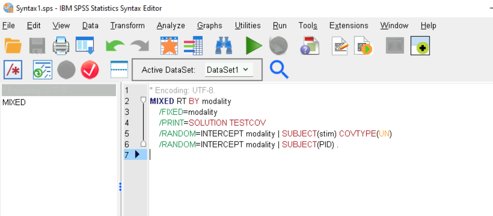

# Linear mixed effect model in SPSS
## based on [Brown (2021)](https://doi.org/10.1177%2F2515245920960351)  

The menus for mixed effects models in SPSS are a little unintuitive (Andy Field calls it an "indecipherable interface"). Here, we use SPSS syntax to replicate the result that we had in R.

## This spss activity is really short  

### Step 1 - import the data
Use text/csv import to read in the "rt_dummy.csv" file that you already downloaded.

### Step 2 - run the mixed effects model
Start a new SPSS syntax window and type out the MIXED command like this:

It may take a long while to run. The output is similar to what we've seen before if you focus on the "Solution for Fixed Effects"

### Interested in learning more about linear mixed models in SPSS?
- [Check out this walkthrough of an analysis of sleep deprivation reaction time data](https://data.library.virginia.edu/comparing-mixed-effect-models-in-r-and-spss/) - by Clay Ford, Statistical Research Consultant, University of Virginia Library