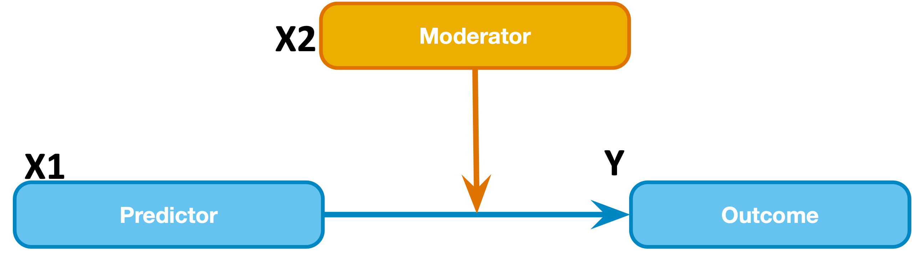
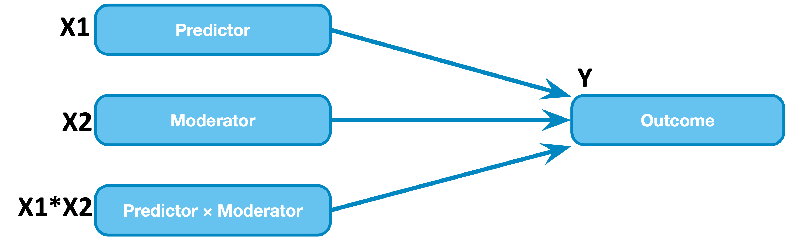
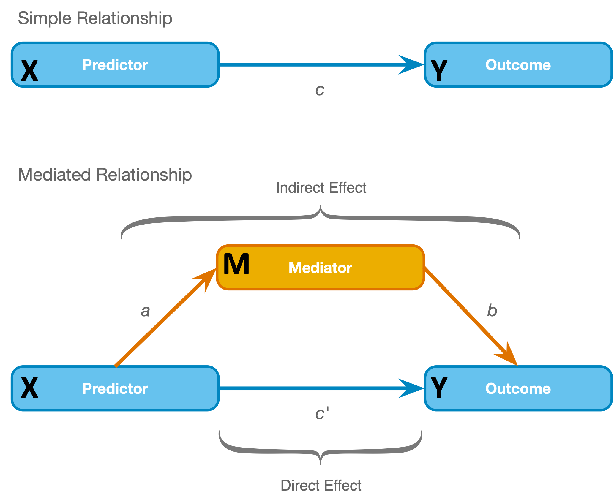

```{r setup, include=FALSE}
knitr::opts_chunk$set(echo = TRUE)
knitr::opts_knit$set(root.dir = rprojroot::find_rstudio_root_file())
library(tidyverse)
source("~/Documents/Teaching/Statistics-Graduate-596/repository/psych596/activities/moderation-mediation/r_docs/process.R", local = knitr::knit_global())
```

### Goals for today - Moderation and Mediation in R  
-  Learn how to model the interaction of 2 continuous predictors in a linear regression model (with a continuous DV)  
    -  Mean centering for interpretation of main effects  
    -  Interpreting interaction coefficients
    -  Calculate simple slopes for one variable at distinct levels of the other variable (+/- 1 SD of 1 variable) to guide interpretation  
-	Mediation using linear regression for 1 continuous hypothesized predictor (X), 1 continuous hypothesized mediator (M), and 1 outcome (Y) (all continous variables)  
    - Use PROCESS to examine conditions for mediation using 3 regression models  
    - identify total effect (c), indirect effect (a*b), and direct effect (c')  
    - interpretation of coefficients  
    - discussion of effect size  
  

## Step 0 - Get organized
- Now open RStudio and start a new project, select "Existing Directory" and select the folder you created for this activity    
- **download (if you haven't already):  [lumos_subset1000pluseye.csv](../data/lumos_subset1000pluseye.csv)**     
- In RStudio, start a new R markdown and do your work in there, save the file in a subfolder called r_docs    
  - put these lines in your "setup" code chunk:  
  `knitr::opts_chunk$set(echo = TRUE)`   
  `knitr::opts_knit$set(root.dir = rprojroot::find_rstudio_root_file())`   
  `library(tidyverse)`  
  - run the setup code chunk  
  
  - in the console, install the "interactions" package by running `install.packages("interactions")` - we will use functions in this package for simple slopes analysis and plots that will help us interpret interaction effects.    
  - in the console, install the "car" package by running `install.packages("car")` - we will use a function in this package to get some extra regression output.    


## Step 1 (Moderation) - Add an interaction term to a linear regression model  

#### Step 1.1 - Import the lumosity dataset (same as last week)  

- data description: lumos_subset1000pluseye.csv is a subset of a public dataset of lumosity (a cognitive training website) user performance data. You can find the publication associated with the full dataset here:  
[Guerra-Carrillo, B., Katovich, K., & Bunge, S. A. (2017). Does higher education hone cognitive functioning and learning efficacy? Findings from a large and diverse sample. PloS one, 12(8), e0182276. https://doi.org/10.1371/journal.pone.0182276](https://doi.org/10.1371/journal.pone.0182276)

- **What to do first:** Make a new code chunk and use readr::read_csv() to read in the data. Make sure that NA values are handled the way you want (click on the tibble in the Environment window pane to take a quick look).   
- **What to do next:** make sure the columns that contain nominal vals are treated as nominal, using forcats::as_factor()  *you can copy your code chunk from last week, or just look at the solution below*

<button class="btn btn-primary" data-toggle="collapse" data-target="#step-1a"> Show/Hide Solution </button>  
<div id="step-1a" class="collapse">  
```{r Step-1a-import, fig.show='hold', results='hold', message=FALSE}
#first import the data
lumos_tib <- readr::read_csv("data/lumos_subset1000pluseye.csv", na = "NA")
# now make sure the columns we want as factors are treated that way, using forcats::as_factor()
lumos_tib <- lumos_tib %>% dplyr::mutate(
  test_type = forcats::as_factor(test_type),
  assessment = forcats::as_factor(assessment),
  gender = forcats::as_factor(gender),
  edu_cat = forcats::as_factor(edu_cat),
  english_nativelang = forcats::as_factor(english_nativelang),
  ethnicity = forcats::as_factor(ethnicity)
)
```
</div>
&nbsp;

#### Step 1.2 - model an interaction between continuous variables  

  

**Above: the conceptual model of moderation**  

    

**Above: the statistical model of moderation** - *notice that X1 and X2 are interchangeable in the statistical model (i.e., the statistical model does not distinguish between the predictor and the moderator)*  

Previously, when we looked just at `age` and `raw_score`, we saw a small association such that older participants scored lower. But what if that association depended on another variable, such as the size of their screen? That is, maybe older individuals do worse than younger individuals only if they are working on a small screen? Such a relationship would be an example of an *interactive effect*, or *moderation* (i.e., screen size *moderates* the effect of age on raw score, or it could be restated as age moderates the effect of screen size on raw score).  
So far, the data we have worked with are real values from Lumosity, but for this step I have created an imaginary variable called `imaginary_screensize` - just for educational purposes.   

**Use a new regression model** (call it `score_ageXscreen_lm`) to examine the interaction of `age` and `imaginary_screensize` on `raw_score`. We include the interaction of two variables in a regression model by multiplying the variables and including that as a predictor. You can specify an interaction in a formula (which you include in a call to `lm()`) like this:  `formula = raw_score ~ age + imaginary_screensize + age:imaginary_screensize` (you may also see interactions specified with a `*`, which is shorthand for including an interaction along with main effects, and you should always include the main effects along with an interaction). **Try it now** (you'll see  soon why we should alter this formula). Use `summary()` to get the model summary.     

<button class="btn btn-primary" data-toggle="collapse" data-target="#step1b"> Show/Hide Solution </button>  
<div id="step1b" class="collapse">  
```{r Step1.2,fig.show='hold', results='hold'}
score_ageXscreen_lm <- lumos_tib %>% drop_na(age,raw_score,imaginary_screensize) %>% 
  lm(formula = raw_score ~ age + imaginary_screensize + age:imaginary_screensize)
summary(score_ageXscreen_lm)
# you might also be interested in multicollinearity info (uncomment the line below)
# car::vif(score_ageXscreen_lm)
```

</div>
&nbsp;

#### Examine the model summary:
1. Notice that there are coefficient estimates for `age`, `imaginary_screensize`, and their interaction (`age:imaginary_screensize`).  

2. The positive coefficient (with low p-value) for the interaction term suggests that at larger screensize values, the relation of age to performance is more positive/less negative than at smaller screensize values. Equally, we could restate it: at older age values, the relation of screensize to performance is more positive/less negative. The coefficient for the interaction term has the same meaning as the other coefficients: that an increase in one unit of the predictor predicts an increase in .002 units of the outcome -- of course the predictor in this case is the product of two variables, so interpretation takes a little more work, which we will do in step 1.4.  

3. But we now have issues with the interpretation of the coefficients for the main effects of `age` and `imaginary_screensize`. **The coefficient for a single variable in a model represents the effect of that variable when other terms are zero.** So the coefficient for `imaginary_screensize` (the main effect of screensize) now represents the effect of screensize at age=0. Likewise, the coefficient for `age` represents the effect of age when screensize=0. Neither effect is interpretable, because of the presence of the interaction.    

#### Step 1.3 - Mean-center the variables  
- If we subtract the mean age from each value of `age` and store it in a new variable called `age_cent` (and do the same for `imaginary_screensize`), then we can enter these new variables into the regression instead. Then we will be able to better understand the resulting main effect coefficients (as, e.g., the effect of age at the mean value of screen size).

- you can create these new "centered" variables using `mutate()` to add new columns the centered variables (`age_cent = age - mean(age)` and `imaginary_screensize_cent = imaginary_screensize - mean(imaginary_screensize)`, but first select only the cases that have valid values for all the columns we are using (`age`, `imaginary_screensize`, `raw_score`) - and store it in a new tibble (call it `lumos_validagerawscreen_tib`), so we can keep track of the fact that the new centered variables are computed based on the reduced dataset (this is not really necessary because all cases have valid values but it is good practice to always be mindful of how many complete cases you have for a given set of variables, because it will affect calculations such as mean-centering (and you should always be watching out for and thinking about missing values).   

- Then re-estimate a new model (store it in a variable called `score_ageXscreen_cent_lm`) that is the same as the last one except you use the centered variables (and interaction of the centered variables) as the predictors. Use `summary()` to get the model summary.   

<button class="btn btn-primary" data-toggle="collapse" data-target="#step1c"> Show/Hide Solution </button>  
<div id="step1c" class="collapse">  
```{r Step1.3,fig.show='hold', results='hold'}
lumos_validagerawscreen_tib <- lumos_tib %>% 
  drop_na(age,raw_score,imaginary_screensize) %>% 
  mutate(
  age_cent = age - mean(age), 
  imaginary_screensize_cent = imaginary_screensize - mean(imaginary_screensize) 
  )
score_ageXscreen_cent_lm <- lumos_validagerawscreen_tib %>% 
  lm(formula = raw_score ~ age_cent + imaginary_screensize_cent +
       age_cent:imaginary_screensize_cent)
summary(score_ageXscreen_cent_lm)
# you might also be interested in multicollinearity info (uncomment line below)
# car::vif(score_ageXscreen_cent_lm)
```
</div>
&nbsp;

##### Now look at the output and notice:  
- the model F-statistic didn't change, it is still significant (low p-value indicates the data and observed F-stat are unlikely under the null hypothesis [that the true value of all coefficients is zero] )  

- the coefficient for the interaction term didn't change (it is positive and the t-stat for the coefficient is the same), but the coefficients (and t-stats) for `age_cent` and `imaginary_screensize_cent` differ from the uncentered version. When an interaction effect is included in a model, centering the variables allows us to interpret the main effects in these two ways (from Field textbook p.792): "(1) they are the effect of that predictor at the mean value of the sample; and (2) they are the average effect of the predictor across the range of scores for the other predictors" - Importantly, `age` is not a significant predictor in this model, meaning that if we hold screen size constant at its mean value then age is not significantly related to performance.     

#### Step 1.4 - Visualize the interaction and calculate simple slopes  

- When age was the only predictor in the regression, we could easily visualize the linear relationship by plotting the regression line (e.g. over a scatter plot), but the (significant) interaction is telling us that the effect of age is different for different levels of screen size - we can't depict that with a single line. Instead, we will plot the model predictions for all values of `age`, but we'll use three lines:  
    (1) one line to show the model prediction for each value of `age_cent` when `imaginary_screensize_cent` is at it's mean value (zero, since we mean-centered it)   
    (2) one line to show the model prediction for each value of `age_cent` when `imaginary_screensize_cent` is at a high value (+1 standard deviation)  
    (3) one line to show the model prediction for each value of `age_cent` when `imaginary_screensize_cent` is at a low value (-1 standard deviation)  

- to generate this plot use the `interactions::interact_plot()` function. You will need to pass it an `model = ...` argument specifying the variable that stores your model (`model = score_ageXscreen_cent_lm` if you are following the provided solution code), as well as `pred = ...` and `modx = ...` arguments to specify the variables to plot as the predictor and the moderator. Add `interval = TRUE` as an argument to get 95% confidence intervals around each line.  

- in the same code chunk, you can also run a "simple slopes" analysis, which is simply a computation of the effect of one variable (`age_cent`) at different levels of another variable (`imaginary_screensize_cent`). We will calculate the effect of `age_cent` at mean and +/- 1SD of `imaginary_screensize_cent`, just like in the interaction plot, so we will actually be calculating the slopes of the 3 lines we plotted.  
    - use `interactions::sim_slopes()`  - just like `interact_plot()`, you will pass it `model = score_ageXscreen_cent_lm`, followed by `pred = ...` and `modx = ...` arguments (another useful argument is `jnplot = TRUE` - we won't cover that here but explore it on your own if you wish).  

<button class="btn btn-primary" data-toggle="collapse" data-target="#step1d"> Show/Hide Solution </button>  
<div id="step1d" class="collapse">  
```{r Step1.4,fig.show='hold', results='hold'}
# plot age vs raw_score at different levels of screensize
p1 <- interactions::interact_plot(model = score_ageXscreen_cent_lm, pred = age_cent, modx = imaginary_screensize_cent, interval = TRUE)
p1 + labs (title = "Age * Screensize Simple Slopes")

#simple slopes of age at 3 levels of screensize
interactions::sim_slopes(model = score_ageXscreen_cent_lm, pred = age_cent, modx = imaginary_screensize_cent)
```
</div>
&nbsp;

#### Interpret the interaction  

Answer the following questions about the model in your notes:  
1) What is the relation between age and performance (`raw_score`) when screen size is held at a low value?  
2) What is the relation between age and performance when screen size is held at its average (mean) value?  
3) What is the relation between age and performance when screen size is held at a large value?  

- Finally, take a look at the Johnson-Neyman interval info (above the "Simple Slopes Analysis" output of `sim_slopes()`). This interval tells us that, below `imaginary_screensize_cent` values of -4.81, we would consider age to have a *significantly negative* (p<.05) relation to performance (according to our model), and above `imaginary_screensize_cent` values of 29.54, age has a *significantly positive* relation to performance. Does this make sense to you? Can you translate those "zones of significance" cutoffs into the original (not mean-centered) `imaginary_screensize` units?

- *Note on effect size* - The R<sup>2</sup> for our full model (`raw_score` = *b*<sub>0</sub> + *b*<sub>1</sub>`age` + *b*<sub>2</sub>`imaginary_screensize` + *b*<sub>3</sub>`age*imaginary_screensize`) is .2578, meaning that the model (age, screensize, and their interaction) accounts for 25.78% of the variance in performance. We can use model comparison to compare a model with versus without the interaction term, which would give an R<sup>2</sup change value attributable to the interaction term (the R<sup>2</sup change is .2578-.2524 = .0054, or about .54% of variance explained by the interaction of age and screen size). *Extra note on the simulated data: the `imaginary_screensize` variable explains an unrealistically large proportion of the variance because it was specially simulated to give us a significant interaction effect.*    

- *Cautionary note on variance partitioning with `anova()`:* If you're curious about how R's `anova()` function works, you would notice that running `anova(score_ageXscreen_cent_lm)` gives us different statistics for individual terms than are given by `summary(score_ageXscreen_cent_lm)`. This is because the R `anova()` function uses type I (also called sequential) sums of squares, so variance is first assigned to the first predictor (age) then the next predictor (screen size), and lastly the interaction, so statistics for individual terms depend on the order they are specified in the model. Our interpretation requires type III (also called partial) sums of squares, where each main effect is assigned variance not accounted for by the other main effect and the interaction (so the order of the terms does not matter). We'll revisit this issue again when we cover interactions between categorical variables.  

## Step 2 - Mediation model   



**Above: the simple three variable model of mediation** - *notice that X and M are distinguished in the model (unlike X1 and X2 in the statistical moderation model)* 

#### What is Mediation?  
**Mediation** refers to a situation when the relationship between a predictor variable (X in the chart above) and an outcome variable (Y in the chart above) can be explained by their relationship to a third variable (the mediator, M).  
Forget about the screen size variable for a moment and consider possible explanations for the negative relation between age and performance that we saw when `age` was our only predictor for `raw_score`.  
Maybe part of the relation could be explained by something like eyesight that deteriorates with age. The data file you imported for this activity has a new (simulated/imaginary) variable called `eyesight_z` which is an eyesight "score" where higher values indicate better eyesight (it has been scaled such that the sample mean is 0 and the s.d. is 1).  
We will test a mediation model where `eyesight_z` explains the relation between `age` and `raw_score`.  
*A note about causality:* In this model we have good reasons for thinking the direction of the relationships is as specified in the mediation model (i.e., it would not be possible for a change in eyesight to cause a change in age, or for a change in test performance to cause a change in eyesight) but there may be many unmeasured variables that could be involved. The test of our mediation model will tell us whether the `eyesight_z` measure accounts for a "significant" part of the relationship between `age` and `raw_score`.  
There are the four conditions for our mediation model test, which are tested with three regression models. **First we will list the regression models (coefficients of each model are different so we'll refer to them each with unique subscripts *b*<sub>1</sub> through *b*<sub>4</sub>):**   

1. `Y` = intercept + *b*<sub>1</sub>`X`  
    - *b*<sub>1</sub> *gives us path c in the chart, also referred to as the "total effect"*  
2. `M` = intercept + *b*<sub>2</sub>`X`     
    - *b*<sub>2</sub> *gives us path a in the chart*  
3. `Y` = intercept + *b*<sub>3</sub>`X` + *b*<sub>4</sub>`M`     
    - *b*<sub>3</sub> gives us path c' in the chart (also called the "direct effect")  
    - *b*<sub>4</sub> gives us path b in the chart   
    
We use these three models to check four conditions of mediation (section 11.4.2 of the Field textbook):  
1. the predictor variable must significantly predict the outcome variable in model 1 (c is significantly different from 0)  
2. the predictor variable must significantly predict the mediator in model 2 (a is significantly different from 0)  
3. the mediator must significantly predict the outcome variable in model 3 (b is significantly different from 0)  
4. the predictor variable must predict the outcome variable less strongly in model 3 than in model 1  (c' is closer to 0 than c, in other words, the direct effect is smaller than the total effect)  

  - how much smaller should the direct effect be? A perfect mediation would reduce the direct effect to zero, but that rarely actually happens.  
  - to assess whether there is a significant reduction (from c to c') we will instead test whether a\*b (called the "indirect effect", literally *b*<sub>2</sub> times *b*<sub>4</sub> from our series of regression models) is significantly different from zero.  
  - Significance of a\*b can be assessed with a Sobel test (textbook section 11.4.2) or by using a bootstrap method to estimate a confidence interval around a\*b.  
  - The `process()` function that we will use  gives us a bootstrapped 95% confidence interval around a\*b, so if the interval does not contain zero, then we can say there is a significant mediation (or, more precisely, we reject the null hypothesis that the indirect effect is zero). Bootstrapping involves taking thousands of repeated random samples of cases from our data (with replacement, so the same case can be included more than once in one repetition) and building a sampling distribution of our parameter of interest from those random samples (they are samples of a sample, hence the term "bootstrapping"). From that sampling distribution we can estimate our parameter of interest (a\*b) and a confidence interval around it.     
    
- You may read some arguments that not all of those 4 conditions are necessary to have evidence of mediation (e.g., c may not be different from 0) but these 4 conditions are a straightforward method to assess a mediation model, so let's get on with it and assess our mediation model (that `eyesight_z` explains the relation between `age` and `raw_score`)      


*Note that we are using a series of linear regression models to test the mediation model, so the assumptions that we need to check are the same ones we discussed in the multiple regression lab activity (but also notice that we will be using bootstrapping to estimate the mediated effect, which eases concern over significance tests on the parameter estimate when assumptions are violated). We won't check assumptions here (to save a little time) but it is a good exercise check the plots of residuals from each model if you have extra time (use the `plot(model)` function).*  

#### Step 2.0 - Setup: download and source `process.R`    

- We will use the `process()` function in an R script developed by Andrew Hayes to test our mediation model. Unlike all the functions we have used before, this function is not contained in an R package, so we can't use `install.packages()`. Instead, we need to download an R-script that has the code for the `process()` function, then *source* the script (*source* just means run the code within your current environment) to make the function available within your project environment. Here is how to do that:  
    1. go to [https://www.processmacro.org/download.html](https://www.processmacro.org/download.html) and download the zip file available at the bottom of the page.
    2. unzip the file (it is probably downloaded to your "Downloads" folder if you are not sure where it went) - be sure that you actually unzip the file rather than just view the contents.  
    3. inside the unzipped folder you will find a folder called "PROCESS v4.0 for R". Move that folder to a location on your computer that makes sense to you. E.g., a folder called "R-general-tools" in your "activities" folder (remember where you put it).  
    4. in your currently open RStudio project for this activity, go to File-\>Open File, and go to the "PROCESS v4.0 for R" wherever you saved it, then open the file called "process.R"  
    5. the "process.R" file should open in you Editor (top-left) pane in RStudio. Click the button at the top of the pane that says "Source". You will see a command running in your Console pane - after a minute or two it will complete and the `process()` function will be available in your environment (you will see it appear in the "Environment" pane under "Functions"). But if you want to be able to "knit" your R markdown doc, you will need to copy that command from the console pane (`source("fullpath_and_foldername/process.R", local = knitr::knit_global())`) into a chunk in your markdown doc.      
    6. go back to your R Markdown file for this activity (tab at the top of your Editor pane).  
    7. you'll need to re-do steps 4 & 5 anytime you close and restart RStudio (unless your preferences are set to save your environment when you close a project)  

#### Step 2.1 - What are the models that we will use to test the four conditions of mediation?  
`X` corresponds to `age`, `Y` to `raw_score`, and `M` to `eyesight_z`, so the three models we use to test the conditions are:  
1. `raw_score` = intercept + *b*<sub>1</sub>`age`  *b1 = path c*  
2. `eyesight_z` = intercept + *b*<sub>2</sub>`age`  *b2 = path a*     
3. `raw_score` = intercept + *b*<sub>3</sub>`age` + *b*<sub>4</sub>`eyesight_z`  *b3 = path c'* and *b4 = path b*

#### Step 2.2 - Use `process()` to estimate the three models  
- you only need one bit of code: pipe your full dataset tibble, `lumos_tib` to the function `process()` with arguments that specify `x = ...`, `y = ...`, `m = ...`, `model = 4`, `total = TRUE`, `effsize = TRUE`  
    - x, y, and m refer to the components of our mediation model  
    - `model = 4` specifies the form of the mediation model (the creator of PROCESS, Andrew Hayes uses different numbers to refer to different types of models, a simple mediation model was assigned as #4 - you can look up the different model numbers in the documentation posted on the class Canvas site)
    - the `total` and `effsize` arguments specify that we want an estimate of the total effect and we want a standardized estimate for the indirect effect  
- see the solution below if you are unsure  

<button class="btn btn-primary" data-toggle="collapse" data-target="#step2b"> Show/Hide Solution </button>  
<div id="step2b" class="collapse">  
```{r Step2.2,fig.show='hold', results='hold'}
lumos_tib %>% drop_na(age,raw_score,eyesight_z) %>% 
  process(y = "raw_score", x = "age", m = "eyesight_z", 
          model = 4, total = TRUE, effsize = TRUE, progress = FALSE)
```
</div>
&nbsp;

#### Step 2.3 - Understand the output of `process()`  

Let's look closely at the output from top to bottom:  

- the section starting with `Outcome Variable: eyesight_z` corresponds to **model #2** of the three models we use to test the mediation.  
    - the `coeff` value for the `age` row gives us *b*<sub>2</sub> (path a)  
    - the `LLCI` and `ULCI` columns give us the lower (LLCI) and upper (ULCI) limits of the 95% confidence interval around each parameter  
    - other columns are labeled similarly to model output you saw in the linear regression lab activity  
- the next section starting with `Outcome Variable: raw_score` corresponds to **model #3** of the three models we use to test the mediation. 
    - the `coeff` for `age` gives us *b*<sub>3</sub> a.k.a path c' a.k.a. the direct effect   
    - the `coeff` for `eyesight_z` gives us *b*<sub>4</sub> a.k.a. path b  
- the section starting with `TOTAL EFFECT MODEL` corresponds to model #1 of the three models we use to test the mediation  
    - the `coeff` for `age` gives us *b*<sub>1</sub> a.k.a path c a.k.a. the total effect (it's the same as the coefficient we got last week when we entered `age` as the only predictor for `raw_score`)  
- **at this point, take a moment** to recognize that the **first three of our four conditions** are satisfied (a, b, and c are significantly different from 0)  

- now look at the section starting "TOTAL, DIRECT, AND INDIRECT EFFECTS OF X ON Y"  
    - the "effect" estimate for the total and direct effects are the same as the coefficients we described above  
    - the "effect" estimate for the "indirect effect of X on Y" **gives us a\*b a.k.a the indirect effect**.    
    - notice that the indirect effect estimate is equal to our estimate of path a multiplied by our estimate of path b, telling us that a *1 unit increase in `age` predicts a -.0276 change in `raw_score`*, considering the indirect path only    
    - the confidence interval around the indirect effect lets us check the **last of the four conditions** of our mediation test - if the 95% confidence interval includes 0, then the condition is not satisfied, but if the limits are both below 0 or both above 0 then we can say that the indirect effect a\*b is "significant"  
    - the "effect" estimate for the "Completely standardized indirect effect ..." is a standardized form of the a\*b coefficient, meaning an increase of one standard deviation in `age` predicts that much decrease in `raw_score` through the indirect path only  
    
#### Answer the following questions in your notes (these are the pieces of information you would report in a manuscript):
1. What is the "total effect" (path c) of age on performance? (coefficient, standard error of the coefficient, confidence interval around the coefficient, R<sup>2</sup>, F, p)  
2. What is the relation of age to eyesight (path a)? (coefficient, standard error of the coefficient, confidence interval around the coefficient)  
3. What is the relation of eyesight to performance, controlling for age (path b)? (coefficient, standard error of the coefficient, confidence interval around the coefficient)  
4. What is the "direct effect" of age on performance, controlling for eyesight (path c')? (coefficient, standard error of the coefficient, confidence interval around the coefficient)  
5. What is the indirect effect of age on performance, through eyesight (path a\*b)?  (coefficient, standard error of the coefficient, confidence interval around the coefficient) 

- One last question to think about: Why didn't we consider `imaginary_screensize` in a mediation model?  

##### A note on effect size measures for the indirect effect  
The "Completely standardized indirect effect(s) of X on Y" section produced by `process()` is essentially a standardized regression coefficient, and as such it can be compared across studies (and is useful for meta-analyses). We could try to compute something similar to R<sup>2</sup>, but all of these measures cause difficulties with how we interpret them, so we may be better off sticking with the standardized indirect effect measure (see the Field textbook section 11.4.3 for full discussion).  

#### That's all for this activity  


## References  
- Chapter 11 of the textbook: Field, A.P. (2018). Discovering Statistics Using IBM SPSS Statistics. 5th Edition. London: Sage.
