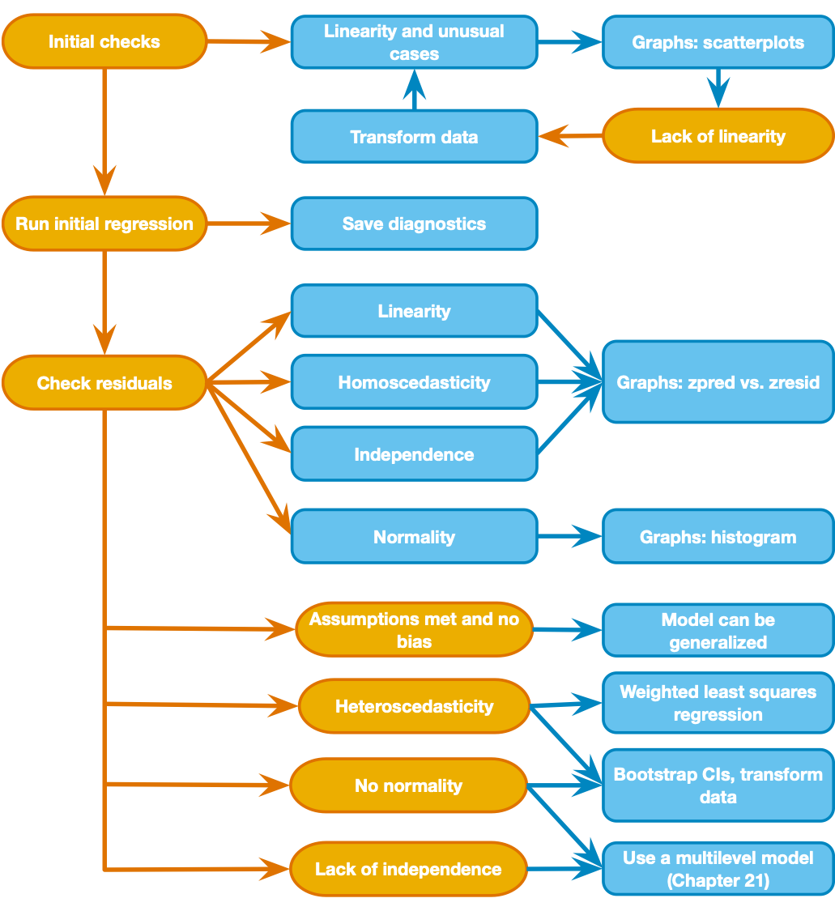

# Associations between variables: Multiple Regression in SPSS  
*edited Feb 21, 2024*  
*Jamil Palacios Bhanji*  

## Goals for today  

-   Learn how to conduct a linear regression with one continuous outcome (interval/ratio scale) and one or more predictors  
    -   understand model R2, F-statistic, beta coefficients (standardized, unstandardized)  
    -   check model residuals for potential sources of bias  
        - linearity, homoscedasticity, independence, normality and extreme cases   
    - F-statistic for model comparisons  
    
-   Learn how to conduct regression with a dichotomous (binary) outcome: logistic regression
    -   why not use regular linear regression?
    -   what is a sigmoid link function (logit)?  
    -   how to interpret logistic regression coefficients  

------------------------------------------------------------------------

## Step 1 - Get organized
- make a folder for today's activity  

- make a "data" folder (inside the project folder)  

- **Download [lumos_subset1000plusimaginary.csv](../data/lumos_subset1000plusimaginary.csv)** and put it in your data folder for this activity   

-  make a "spss" folder (inside the project folder) for your SPSS files  

------------------------------------------------------------------------

## Step 2 - Import data and check it out  

*Data description:* lumos_subset1000plusimaginary.csv is the same file we worked with last week, but with one extra variable added ("imaginary\_screensize" - this is a fabricated variable that is not part of the real dataset).  

This is subset of a public dataset of Lumosity (a cognitive training website) user performance data. You can find the publication associated with the full dataset here:  
[Guerra-Carrillo, B., Katovich, K., & Bunge, S. A. (2017). Does higher education hone cognitive functioning and learning efficacy? Findings from a large and diverse sample. PloS one, 12(8), e0182276. https://doi.org/10.1371/journal.pone.0182276](https://doi.org/10.1371/journal.pone.0182276)

**Import the data:** Open SPSS and use File -\> Import Data-\> CSV or Text Data  - now check the variable types and add labels if you wish. **Careful! If you use "import text data" make sure you set the only delimiter as "comma"** (SPSS may automatically also treat "space" as a delimiter, so uncheck that option)    

**What to do next:**  

- look at the format of the data file - each row has all measures for 1 individual ("ID" is the unique identifier)  
- check the data types for each variable (gender, as nominal, ...)  
   
------------------------------------------------------------------------

## Step 3 - The General Linear Model (GLM) with one predictor  

**A note about terminology:** In this lab activity we will use the terms "predictor", "independent variable (IV)", and "explanatory variable" interchangeably to refer to variables that are entered as explanatory terms in the model. We will use the terms "dependent variable" and "outcome variable" interchangeably to refer to the variable that is being explained. You should be mindful of the implications of these words (e.g., about causality, which cannot be inferred simply by assigning one variable as a predictor and another as an outcome) but we won't focus on language in this lab. Instead, you should get used to the different terminology that is used.   

{width=50%} 

#### Above is the decision process chart from the book.  

- Following the chart, we start by using scatter plots to check for non-linear associations and unusual cases. 
- Last week we looked at scatter plots  of `pretest_score`, `raw_score`, and `age`. The linearity assumption was reasonable and there were no concerning outliers. Let's use a shortcut to recreate those scatter plots all at once. Go to Graphs-\>Chart Builder, and choose "Scatterplot Matrix" by dragging it up from the Gallery (under "Scatter/Dot") to the preview area. Then drag the 3 variables to the "Scattermatrix?" box in the preview. Click OK to generate the plot.    
- Add histograms to the matrix by double clicking on the chart in the output window to open the Chart Editor, then go to Options (in the Chart Editor window or on Macs in the top menu bar after clicking on the Chart Editor)-\>Show Charts in the Diagonal. A histogram for each variable should appear in the diagonal cells of the matrix now. Close the Chart Editor Window.   

- Notice that the `age` variable is not normally distributed (why do you think that is?), but normality of the variables, especially with a large data set is not a concern. The scatters show that a linear relation between variables is reasonable    
- So let's dive straight in and use linear regression with `age` as an explanatory variable for `raw_score`  
  1. Analyze-\>Regression-\>Linear  
  2. Enter `raw_score` as the Dependent  
  3. Enter `age` as the Independent

### Looking at the output:  
1. In the **Model Summary** table, the R-square value tells us that the model (`raw_score` = *b*0 + *b*1`age`) explains about 1% of the variance in `raw_score` (a small effect by most standards, but could be important in some contexts).  
2. In the **ANOVA table**, the F-statistic is the ratio of variance explained by the model to the error within the model (Mean Square for the model divided by Mean Square of the Residual). The "Sig." value (aka p-value) tells you the probability of an F-statistic at least that large under the null hypothesis.    
3. In the **Coefficients table**   
  - **Constant:** the intercept (*b*0) of the regression line. If all predictors were at their zero level (i.e., at age zero) the model predicts a `raw_score` of 17.84. It doesn't make a lot of sense to talk about a score for someone aged zero, but this is how linear models work. If you wanted an interpretable intercept you could re-scale `age` so that it's zero value was something meaningful (e.g., re-center to mean=0, then the intercept would correspond to the predicted score for someone with the mean age).  

  -  **Unstandardized parameter estimates for each IV:** In the "Unstandardized B" column, you get *b*1 for the `age` term in the regression equation. This value (-.041) tells us that an increase of one unit in the predictor (1 year of age) gives a change of -.041 units in the outcome (raw_score), according to the model. In other words, the model predicts that two people one year apart in age will be .04 units apart in their performance score (the older person having the lower predicted score).  

  -  **Standard Error for the parameter estimates:** The "Std. Error" column gives the standard error of each estimated parameter (intercept and age coefficient). For an excellent visual explanation of standard error of regression parameters, see the [Andy Field video on the topic (same as the one in the syllabus)](https://youtu.be/3L9ZMdzJyyI).  

  - **Standardized Coefficients:**  The standardized coefficient for `age` indicates that a change of +1 standard deviation in age predicts a change of -.101 standard deviations in `raw_score`. We would get this value as the *b*1 if we first standardized each IV & the DV (subtracted the mean and divided by std deviation) and then ran the regression model.  There is no standardized value for the Constant because (a) you can't standardized a constant value (the std deviation is zero), (b) the intercept is always zero when the variables are standardized.  
  - **t and Sig.:** The "t" column gives the t-stat for each estimate (estimate/std err) and the "Sig." column gives the probability (p-value) of observing a t-stat that far from zero under the null hypothesis.  
     - notice that the p-value for `age` is the same as the overall p-value - this is because age is the only predictor in the model
     - notice that the t-stat and p-value for `age` are the same as the t-stat and p-value the we got last week for the correlation between `age` and `raw_score` - this is because the pearson correlation is also a test of a linear relation (and `age` is the only predictor)  
     - the constant/intercept in our model is not meaningful (`raw_score` when `age` is zero), so we have no interpretation for the t and p-value of the constant/intercept.  

  
------------------------------------------------------------------------

## Step 4 - The General Linear Model (GLM) with multiple predictors, model comparison, model diagnostics (steps 4, 5, and 6 in the RStudio activity)  

Now let's add `pretest_score` to our model, so that we are predicting `raw_score` as a function of `age` and `pretest_score`.  

- We will do this by going back to the "Linear Regression" dialog box and then
  - keep `raw_score` as the Dependent and `age` as the predictor for "Block 1" 
  - click "Next" and enter `pretest_score` as a predictor in "Block 2" (keep the Method as "Enter" - see sections 9.9 to 9.10 in the Field textbook for explanation of the Method options). This tells SPSS to estimate two models: Model 1 has just `age` as a predictor, Model 2 has `age` and `pretest_score` as predictors.  
  - click "Statistics" and select "Estimates", "Confidence Intervals", "Model fit", "R squared change", and "Collinearity diagnostics" --  see section 9.10.2 of the Field textbook for full explanation all options. Here we'll focus on a subset of this info.   
  - click "Continue" to get back to the main Regression dialog, then click "Plots". Be sure to check  to check the boxes for "histogram" and "Normal probability plots." Create a plot of ZRESID against ZPRED (you may also create other plots such as SRESID against ZPRED as explained in section 9.10.3 of the Field textbook)  
  - click "OK" to run the regression models

- take a look at the output. The **Model Summary**, **ANOVA**, and **Coefficients** tables have the same information that we had in our previous model (`age` as the only predictor), but now it is labeled as "Model 1". We also have information for "Model 2" which includes both `age` and `pretest_score` as predictors. In addition, now we have some extra columns in the **Model Summary** table under the heading "Change statistics" because we selected the "R squared change" option this time. Our interpretation of all the info is the same as before, but the change statistics now give us some info to ***compare the two models***:
    - **R Square Change:** the increase in proportion of variance explained by one model compared to another. For Model 1, this is compared to the no-predictor model, thus the number is equal to the R squared value for Model 1. For Model 2, this is the increase in R squared for Model 2 compared to Model 1 (.608 - .010 = .597 #with a little rounding error). This tells us that adding `pretest_score` to the model increased the proportion of variance explained by .597.  
    - **F Change (and Sig.):** For Model 1 it is the same as the F-statistic (Mean Square for the model divided by Mean Square of the Residual). For Model 2 it is essentially a ratio of error (RSS=residual sum of squares) of one model to the other. If one model is better at explaining the outcome than the other, than the RSS of the worse model will be greater than the RSS of the better model, and the F-statistic quantifies that for us (and gives a Sig./p-value under the null hypothesis that the models are equivalent). Here the F change stat is calculated as in equation 9.18 in the Field textbook. The Sig. value here tells us that the F change stat is unlikely (p < .001 - for the exact value you can double click on the table) under the null hypothesis (that the models are equivalent). In other words, the difference in variance explained by `age`+`pretest_score` vs `age` alone is unlikely if the models are equivalent (so the fuller model is better at explaining variance). A few points to keep in mind:   
      - When you report a model comparison this way you would report the F-statistic as well as the change in R-squared (R2 of better model minus R2 of the worse model). But one important issue is that adding more predictors will always increase R2.  
      - For this reason you may also report other indicators of model fit that account for the number of predictors, such as AIC and BIC (see Chapter 9 of the Field Textbook).  
      - You can't get an AIC value from SPSS using the Linear Regression dialog box but there are other ways to get it - see section 9.9.2 of the textbook and [this page by Jeramy Townsley](http://fallcreekrenovation.blogspot.com/2013/04/comparing-between-regression-models.html).  

    - **Collinearity Statistics:** (in the **Coefficients** table) In any model with multiple predictors, if predictors in the model are highly correlated with each other, we have *multi-collinearity* (see Field textbook section 9.9.3). This causes issues where the estimates of coefficients for correlated predictors are unstable (large std err and highly variable across samples). Thus, if our predictors are collinear, we can't assess their individual importance in the model (and can't trust the t and Sig. values of collinear predictors). An easy way to check for multi-collinearity is by looking at the *VIF* (variance inflation factor, listed for each predictor). It measures the shared variance between one predictor and the others. The reciprocal of VIF is called *tolerance*. A general rule of thumb is that you should worry if you have VIF > 5 for any predictor in the model.  You will also see a separate table called **Collinearity Diagnostics** - this has more detailed information on collinearity between pairs of predictors, but the tolerance and VIF information in the **Coefficients** table is generally sufficient to identify a problem.    

#### Model Diagnostics  

Now that we have run the regression model, we have to check on the assumptions that we made. Let's look back at our decision chart - it says we can use a graph of "zpred vs zresid" to check for linearity, heteroscedasticity, and independence, then look at a histogram of residuals to check for normality. These are all plots created from the Model 2 residuals (difference between the `raw_score` value predicted by the model, and the actual `raw_score` value for each case in the dataset). These charts should appear in the output you generated from the last regression:  

1. "Scatterplot- Dependent Variable: raw_score" - this is the"zpred vs zresid" and is useful for checking linearity, heteroscedasticity, and independence. We are basically checking to make sure there are no clear patterns in the residuals. 

  - Here are some [examples of patterns](../images/residualpatterns.png) you might see in residuals that indicate sources of bias (from Prof Andy Field's discovr tutorial section 08 - *note that the non-linear example is also an example of non-independence, because the residuals are related to the fitted values.*)  

2. "Histogram- Dependent Variable: raw_score" - this is a histogram of the residuals. You expect to see a normal curve shape. Look at this plot along with the "Normal P-P" plot to assess the normality assumption.

3. "Normal P-P" - this is a P-P plot of the residuals (like a Q-Q plot but of cumulative probability rather than quantiles), and helps us check for non-normally distributed residuals. We expect points to fall close to the diagonal line if the residuals are normal (they do here).  

#### Now that you have reviewed the output, answer the following questions for yourself about the full model (`raw_score` = *b*0 + *b*1`age` + *b*2`pretest_score`) 
1. What does the Model R-square tell you for this model? That is, what percent of the variance in `raw_score` is explained by the model with age and pretest score as predictors?
2. What does the overall F-statistic and p-value tell you?  
3. What does the beta coefficient for `pretest_score` tell you?  
4. What does it mean that the t-statistic for the `age` variable is not significant in this model? How does it compare to the partial correlation test that we ran last week with the same variables?    

----------------------------------------------------------------------------

## Step 5 - Dichotomous outcome: logistic regression (Step 8 in the RStudio activity)  

Logistic regression is used when the outcome variable has just two possible values (e.g., true/false, on/off, yes/no, or greater/less than some critical threshold). For the sake of learning, let's imagine that a `raw_score` value of 16 or greater wins a \$100 prize, so we want to see if we can explain who wins the prize based only on the users' years of education (`years_edu`).  
**Why can't we run a regular linear regression?** - Because regular linear regression will give you predicted values that fall outside the possible outcome values (0 and 1) and are not interpretable.  
On the other hand, logistic regression will yield predicted values between 0 and 1 that can be interpreted as the probability of the outcome (e.g., prize received) occurring. These predicted values follow a sigmoid-shaped logit function.  

**A sigmoid-shaped logistic function looks something like this:** 
When applied to a logistic regression, the x-axis is a hypothetical predictor and the y-axis is the probability of the outcome occuring.  
*image below from [wikipedia: logistic function](https://en.wikipedia.org/wiki/Logistic_function)*  

#### Let's estimate a logistic model now  

- First create a new variable called `prize` that is 1 if `raw_score` is >= 16, 0 otherwise.  
    - Use **Transform-\>Compute Variable**, then type "prize" in the box for "target variable" and use "raw_score >= 16" as the Numeric Expression. Now click "OK" and you will see a new nominal variable in the dataset with a value of 1 wherever `raw_score` is greater than or equal to 16, and 0 otherwise.  
    - Make sure that the `years_edu` variable is *Type: Numeric* and *Measure: Scale* (change it in the variable view if needed)  
- Now go to **Analyze-\>Regression-\>Binary Logistic**  
    - enter the new `prize` variable as the Dependent  
    - enter `years_edu` as the predictor in Block 1  
    - under "options" select "classification plots" and keep "Include constant" selected. Then click Continue and OK to run the regression  

       
#### Look at the output:  

- Notice that there are 205 missing cases, because they had no value `years_edu`. We could have selected only valid cases in the data set before hand, but SPSS has done it for us in this case.  
- Now look at the **Block 0 Classification Table**: Block 0 does not include our predictor, `years_edu`. In this null/uninformed model, the most common outcome (prize received) is the model's prediction for every case. This gives us 423 correctly classified values and 372 incorrectly classified values (because 423 users received the prize and the null model predicted that everyone got the prize). So the null model classifies 53.2% (423/795) of cases correctly.   
- Now skip down to the **Block 1 Classification Table** - This is for the model that includes `years_edu` as a predictor for whether the prize was received. The table shows how many cases the model (now including `years_edu`) predicted to have a `prize` value of 1 (meaning the predicted probability from the logit function was > .5), and this is split up according to whether the actual/observed value was 1. So the overall accuracy is (165+313)/795 = 60.13%  

- Now look at the **Variables in the Equation** table. Let's focus on the coefficient estimate for `years_edu`. In logistic regression, the coefficients are in units of log(odds) (log = natural logarithm). This means that if we increase a value of `years_edu` by one unit the model would predict an increase of .151 in the log(odds) of receiving a prize. We can try to make that more understandable by converting the coefficient to an odds ratio by *exponentiating* it (raising *e* to the power of the coefficient - see section 20.3.5 of the Field textbook). If you exponentiate our coefficient of .151 you get *e*0.151 = 1.16,  meaning that a 1 year increase in `years_edu` would predict a ~16% increase in odds of receiving the prize (according to the model).  

- Let's look at our significance tests now. There are two types of significance tests in the output: 1 for the overall model fit (a Chi-square stat based on log likelihood - see below), and 1 for  individual predictors in the model (a Wald z2 stat, which also follows a Chi-square distribution). This is analagous to our individual coefficient t-stats and overall F-stat in the linear regression example.  
    - the Chi-square test of model fit is in the **Model Summary** table. This test is based on the log-likelhood of the model. From the Field textbook, "log-likelihood is based on summing the probabilities associated with the predicted, P(Yi), and actual, Yi, outcomes. It is analogous to the residual sum of
squares in the sense that it is an indicator of how much unexplained information there is after the model has been fitted." (p. 1378, section 20.3.2). The log-likelihood is used to compute a deviance statistic that has a Chi-square distribution, and we use the Chi-square distribution to compute the probability of obtaining a statistic that large under the null hypothesis to get our overall model significance (p-value).  
    - the Wald z2 stat for each term is based on the coefficient divided by its standard error, and it follows a Chi-square distribution. So the Sig. value tells us the probability of a coefficient this large under the null hypothesis. The Field textbook advises that we interpret this probability with caution because the p-value can be inaccurate for large coefficients. Significance of individual predictors is best done by using the likelihood ratio test (Chi-square) to compare a model with versus without each predictor. In SPSS you can do this by entering each predictor in a separate Block, then the **Model Summary** will give you tests that compare models between each Block.    

- Notice in the **Model Summary (Block 1)** there are "Cox & Snell:" and "Nagelkerke:" R2 values. This is because there is no universally agreed method for computing R2 for logistic regression - both methods conceptually quantify how well the model explains the outcome variable (see section 20.3.3 of the Field textbook for more info).  

- We didn't check the same sources of bias (non-linearity, heteroscedasticity, lack of independence) that we did for the linear regression example. Rather than linearity, logistic regression assumes that the relation of predictors to log(odds) of the outcome is linear. Homoscedasticity/Homogeneity of variance is not an assumption of logistic regression. We do need to assume independence, because non-independent measures (e.g., unmodeled groups or repeated measures) cause a problem called *overdispersion*.  Refer to the Field textbook (Chapter 20) for a complete overview of logistic regression and how to check assumptions.  

#### That's all for this part, have some fun in RStudio now!

----------------------------------------------------------------------------

## References

- Chapters 9, 20 of textbook:  
Field, A.P. (2018). Discovering Statistics Using IBM SPSS Statistics. 5th Edition. London: Sage.