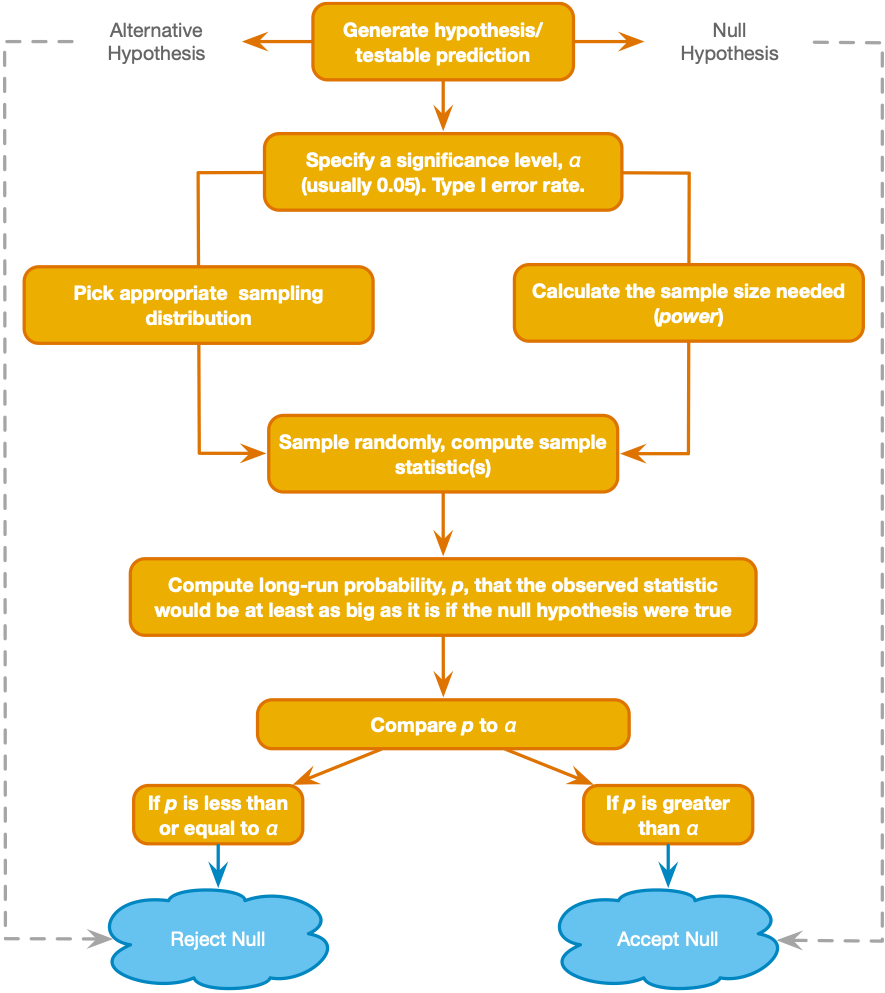
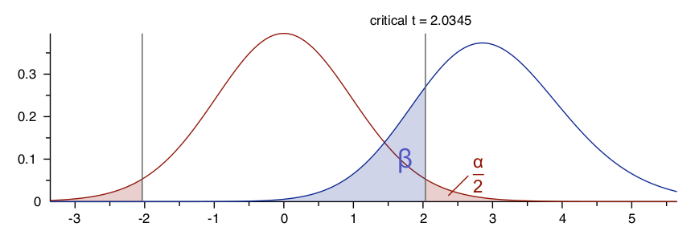
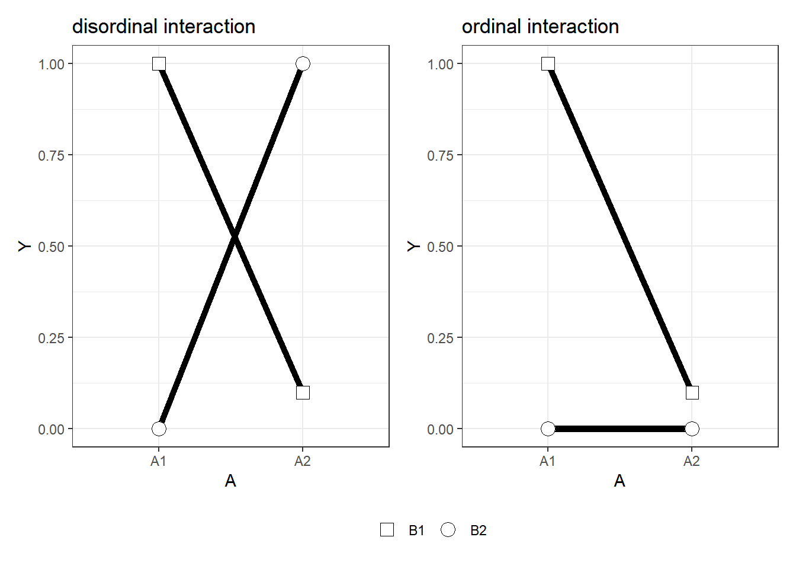

# Power analysis activity in G*Power  

*last edited Sept 13, 2021*  

------------------------------------------------------------------

## Goals for today  

- Review of statistical power analysis
  - What is statistical power? (in null hypothesis significance testing)  
  - What is the purpose of power analysis?   
  - What pieces of information are necessary to conduct a power analysis?  
  - What are some approaches to determine a target effect size?   
- Learn how to conduct a power analysis for common experimental designs:
  - 1 group, 1 variable (t-test of mean, effect size d)  
  - 2 groups, 1 variable (independent samples t-test, effect size d with pooled SD)  
  - 1 group, 2 variable (correlation, effect size r)
  - more than 2 groups, 1 variable (ANOVA, effect size eta2  or Cohen f)
  - 2 group, 2 between × 2 within (mixed ANOVA)  
- Understand the effect of multiple comparisons on Type 1 error
  - Go through an example of correcting for multiple comparisons using Bonferroni correction for pairwise comparisons in 2 × 2 design  
  - Understand the concept and consequences of p-hacking  
- Examine examples of power analysis or sample size description in recent publications  

------------------------------------------------------------------

### What is statistical power?

In null hypothesis significance testing, power is a measure of how effective a statistical procedure is at identifying real differences (or associations) in populations: It is the probability that the null hypothesis will be correctly rejected when the alternative hypothesis is true.  

### What is the purpose of a power analysis?  

In experiment design (before collecting data), we use power analysis to determine  
(a) given a certain sample size and true effect size, what is the power of the statistical procedure (i.e. probability of correctly rejecting the null hypothesis)?  
or  
(b) given a desired level of power (e.g., 80%), what is the sample size required to achieve that power?  

  

### What information is needed to conduct a power analysis?  
From *Cohen (1992)*: "Statistical power analysis exploits the relationships among the four variables involved in statistical inference ... For any statistical model, these relationships are such that each is a function of the other three."  

These are the four variables:  
1. **Effect size** - The true magnitude of the difference or association that you aim to observe (also called "target effect size"). This is usually expressed as a standardized difference (for a difference between means) or proportion of explained variance (for an association between variables). When the true effect size is larger, power is greater.    
    - For this lab, we will be using Cohen's d (for test of means for one or two groups), the correlation coefficient r (for correlation between two measures), or Cohen's f (for tests of more than two means). Cohen's d and f are based on the mean differences (e.g., between two groups) divided by the standard deviation of the measure. Pearson's r is a measure of standardized covariance between 2 measures.   
    - In Week 8, we'll read Lakens (2013) for a more detailed understanding of standardized effect sizes and how they are computed.   
2. **Alpha error** - The probability of incorrectly rejecting a true null hypothesis (i.e., committing a Type I error). For a power analysis, you must define an acceptable threshold for alpha error (often .05). When your alpha threshold is lower, power is lower.  
3. **Sample size** - The number of cases randomly sampled from the population. When the sample size is greater, power is greater. Often, instead of computing power for a given sample size, you may want to compute the minimum sample size to achieve a given level of power.  
4. **Statistical Power** - Defined above. We can determine the power of a procedure based on the first 3 variables, but usually instead we start with a desired level of power (e.g., .8 or 80%), and determine the minimum sample size needed to achieve that power level.  
*Another term you have heard:* ***Beta error*** - *(equal to 1 - power) The probability that the procedure will incorrectly fail to reject the null hypothesis when the alternative hypothesis is true (type II error).*  

### How do I determine the effect size before I run the experiment?  
A few approaches (covered in lecture):  
1. Estimate the true effect size based on literature review of similar measures and methods. It is best if you base the estimate on many studies (or a meta-analysis) because an effect size from a single sample may have a large confidence interval.  
2. Run a pilot study. Then you will have an effect size estimate for the exact procedures you intend to use, but remember that an effect size from a single study may have a large confidence interval.  
3. Determine what is the minimum effect of interest. You may be able to argue that a certain effect size is the smallest effect that would be meaningful (for the scientific purpose of the study). Then you can calculate power to detect that minimum effect of interest.  
4. Use effect size benchmarks (small, medium, large). You can simply design your study to detect a benchmark effect size with a specified power level. This approach is often criticized but it is very common.  

### How do I run a power analysis?  
There are plenty of tools available for power analysis (e.g., [the pwr package for R](http://cran.r-project.org/web/packages/pwr/index.html), [simulation-based tools](https://arcstats.io/shiny/anova-power/), [web calculators](https://www.stat.ubc.ca/~rollin/stats/ssize/n2.html), ...). Here, we will use G*Power because it is easy to use and covers a lot of common experiment designs.

#### Example #1: One group, one variable  
Let's say you plan to have one group of participants undergo an acute stress procedure, and you plan to measure participants' pupil diameter while looking at pictures of chocolate cake (after the stress procedure). You will end up with one measure per participant (by taking that average pupil diameter across all trials). You expect the measure to be normally distributed. The null hypothesis is that:  

*H0: the group's mean pupil diameter measurement is 4.0mm* (let's pretend that is the known non-stressed population mean).  

The alternative hypothesis is that:  
*Ha: mean pupil diameter is* ***different than 4.0mm*** (i.e., higher or lower).     

You will use a 1-sample t-test (2 tailed) of the group mean pupil diameter compared to the 4mm reference. You want to know **what is the sample size** you need to achieve 80% (.8) power for this procedure, if the true effect size is d=.5 (based on a meta-analysis - *note that this effect size is fictional*). Your alpha error threshold is .05, so now you have the three variables you need (effect size, alpha error, and statistical power) to determine the fourth (sample size) for the specified statistical model.  

Use these settings in G\*Power to calculate the sample size you need:  
1. *test family* = t tests  
2. *statistical test* = Means: difference from constant  
3. *Type of power analysis* = A priori: compute required sample size  
4. *Inputs*: 2 tails, effect size d = .5, alpha err prob = .05, power = .8

Click on the "calculate" button when you are ready

##### Now answer the following questions in your notes:  
- What is the required sample size (for the requirements given above)?  
- Try increasing the true effect size (imagine that new evidence came out suggesting the true effect is actually d=.8). what happens to the required sample size? What happens when you decrease the effect size?

##### Now take a moment to understand the 2 curves in the graphic at the top  
  
 - The x-axis is possible values of the test statistic (in this case a t-stat)  
 - The y-axis is relative probability (for a given value of the test statistic)  
 - each point on the red curve (the central distribution) represents the probability of obtaining a given test statistic under the null hypothesis (given the calculated sample size)  
 - each point on the blue curve (noncentral distribution) represents the probability of obtaining a given test statistic under the alternative hypothesis (given the true effect size and calculated sample size)  
 - the vertical line represents the critical statistic value (if you obtained a greater value you would reject the null)  
 - the red shaded region represents type 1 error probability  
 - the blue shaded region represents type 2 error probability  

#### Example 2: Two groups, one variable  
Now let's say you plan to have participants randomly assigned to one of two groups: 1 group undergoes an acute stress procedure, and 1 group undergoes a non-stress control procedure. You plan to measure participants' pupil diameter while looking at pictures of chocolate cake (after the stress/control procedure). You expect the measure to be normally distributed. The null hypothesis is:  

*H0: the each group's mean pupil diameter measurement is equivalent* (i.e., that stress has no effect on pupil diameter).  

The alternative hypothesis is:  
*Ha: that mean pupil diameter is* **different for the two groups** (i.e., the stress group mean is higher or lower than the control group mean).     

You will use a 2-sample t-test (2 tailed) of the stress group mean pupil diameter compared to the control group mean. You want to know **what is the sample size** you need to achieve 80% (.8) power for this procedure, if the true effect size is d=.5 (based on a meta-analysis - *note that this effect size is fictional*). Your alpha error threshold is .05, so now you have the three variables you need (effect size, alpha error, and statistical power) to determine the fourth (sample size) for the specified statistical model.  

Use these settings in G\*Power to calculate the sample size you need:  
1. *test family* = t tests  
2. *statistical test* = Means: difference between two independent means  
3. *Type of power analysis* = A priori: compute required sample size  
4. *Inputs*: 2 tails, effect size d = .5, alpha err prob = .05, power = .8. Enter *allocation ratio = 1* (this means your two groups will be of equal size)

Click on the "calculate" button when you are ready

##### Now answer the following questions in your notes:  
- What is the required sample size (for the requirements given above)?   
- The three parameters were the same as in the first example (effect size, alpha error, and statistical power), so why is the sample size required different?  
- What if you change it from a two-tailed to a one-tailed test? (meaning you change your statistical model and your alternative hypothesis is now that mean pupil diameter in the stress group is *greater* than in the control group) -- How does the required sample size change? Do the central and noncentral distribution curves look any different?   

#### Example 3: One group, two variables  
Let's say you plan to have one group of participants and you will take two measures: (1) each participants' pupil diameter while looking at pictures of chocolate cake, and (2) each participant's mean preference rating for all the pictures of chocolate cake (ratings are on a 7-point scale: *dislike strongly* to *like strongly*). You expect both measures to be normally distributed. The null hypothesis is  

*H0: there is no correlation between pupil diameter and preference rating* (the correlation coefficient is zero).  

The alternative hypothesis is  
*Ha: the correlation between mean pupil diameter is* ***different than 0*** (i.e., Pearson correlation is higher or lower than zero).     

You will use a correlation test (2 tailed) of the stress group mean pupil diameter compared to the control group mean. You want to know **what is the sample size** you need to achieve 80% (.8) power for this procedure, if the true population correlation coefficient (true effect size) is ρ =.5 (based on a meta-analysis - *note that this effect size is fictional*). "ρ" is the same as the correlation coefficient r, but the symbol "ρ" is used to distinguish that it refers to a population rather than a sample from the population (this distinction is not always consistent, and "ρ" has other meanings, but in G*Power it is referring to the population correlation coefficient). Your alpha error threshold is .05, so now you have the three variables you need (effect size, alpha error, and statistical power) to determine the fourth (sample size) for the specified statistical model.  

Use these settings in G\*Power to calculate the sample size you need:  
1. *test family* = Exact  
2. *statistical test* = Correlation: Bivariate normal model  
3. *Type of power analysis* = A priori: compute required sample size  
4. *Inputs*: 2 tails, effect size ρ = .4, alpha err prob = .05, power = .8, correlation ρ H0 = 0

Click on the "calculate" button when you are ready

##### Now answer the following questions in your notes:  
- What is the required sample size (for the requirements given above)?  
- If you wanted to have 95% power (.95) for the same test, how large would your sample need to be?  

#### Example 4: 3 groups, one variable (one way ANOVA)  
Now imagine you plan to have participants randomly assigned to one of three groups: 1 group gets a weak health reminder, 1 group gets a strong health reminder, and 1 group gets no reminder. You plan to measure participants' pupil diameter while looking at pictures of chocolate cake (after the reminders). You expect the measure to be normally distributed. The null hypothesis is  

*H0: the each group's mean pupil diameter measurement is equivalent.*  
 
The alternative hypothesis is  
*Ha: that mean pupil diameter is* **not equivalent for all groups**.     

You will use an omnibus one way analysis of variance (ANOVA, F-test). From a pilot study you were able to estimate an effect size of the group treatment expressed as a partial η2=0.15 (meaning that 15% of the variance in pupil diameter is attributable to the group treatment). You want to know **what is the sample size** you need to achieve 80% (.8) power for this procedure. Your alpha error threshold is .05, so now you have the three variables you need (effect size, alpha error, and statistical power) to determine the fourth (sample size) for the specified statistical model.  

Use these settings in G\*Power to calculate the sample size you need:  
1. *test family* = F tests  
2. *statistical test* = ANOVA: Fixed effects, omnibus, one way  
3. *Type of power analysis* = A priori: compute required sample size  
4. *Inputs*: alpha err prob = .05, power = .8, groups = 3. For effect size, notice that G\*Power wants the effect size expressed as f *(don't get this confused with the F-statistic from an ANOVA)* - this refers to Cohen's f, which can be computed from the partial η2 value that you have. Click on the "Determine" button to open the effect size calculator window in G\*Power. Then use the "Direct" option to enter your partial η2 value and convert it to a Cohen's f.   

Click on the "calculate" button when you are ready.

##### Now take some notes:  
- What is the required sample size (for the requirements given above)? *Note: G\*Power gives you total sample size, so for a 3 group design it will be a multiple of 3*   
- Why do the distribution curves look so different for this design (e.g., no negative values)?  (We haven't fully explained the F-statistic yet, so you're not expected to know the answer - just take a moment to notice the difference in the curves and we will discuss when we re-convene)  
- note from the instructors - we gave you the effect size as partial η2 because that is the effect size measure that SPSS gives you for the ANOVA procedure, and it is commonly reported for ANOVAs in psychology journals.  

#### Example 5: 2 groups, 1 within subject factor (2 levels)

Now, imagine we plan to measure pupil diameter under different conditions that are determined by manipulation of two factors: health prime (2 levels: health prime or no health prime), and picture type (2 levels: chocolate cakes or books). Participants will be randomly assigned to receive a health prime or no prime (thus, the prime is a between subjects factor), then all participants will look at pictures of chocolate cake and books while their pupil diameter is measured for each (thus, picture type is a within subject factor). This is a 2 group design where you will have 2 (repeated) measurements for each participant (pupil diameter for chocolate cake pictures, pupil diameter for book pictures).  
You expect the measures to be normally distributed. You are primarily interested in the interactive effect of the prime and the picture type, so the null hypothesis is  

*H0: the difference between mean pupil diameter for cake compared to book pictures* ***is equal for the health prime compared to no prime group.***  (the difference between differences is zero)  

The alternative hypothesis is  
*Ha: **the difference between mean pupil diameter for cake compared to book pictures is not equivalent for the health prime compared to no prime group**.  

*Note that in this factorial design we could specify distinct hypotheses related to the two main effects as well*

You want to calculate sample size needed for 80% power (alpha = .05) to reject the null of no interaction effect, assuming an interaction effect size of partial η2 = .09 for the interactive effect (let's say this is the minimum effect size that would be of interest to you). Let's also assume that the pupil diameter measure for the chocolate cake pictures is correlated with the pupil diameter measure for the book pictures with r=.5   

Use these settings in G\*Power to calculate the sample size you need:  
1. *test family* = F tests  
2. *statistical test* = ANOVA: Repeated measures, within-between interaction  
3. *Type of power analysis* = A priori: compute required sample size  
4. *Inputs*: alpha err prob = .05, power = .8, groups = 2, number of measurements = 2, corr among rep measures = .4. Use the effect size calculator ("Determine") to convert the given partial η2 to Cohen f.   Enter 1 for the non-sphericity correction (this is the only possible value because sphericity is only relevant with more than 2 within subject measures) 

Click on the "calculate" button when you are ready.

##### Now take some notes:  
- what is the required total sample size?  
- wait - doesn't that seem kind of low?  
  - yes, G\*Power is actually telling us the sample size required to reject the null for any of the 3 effects tested in the ANOVA design (main effect of health prime, main effect of picture type, or interaction of the two). The (within subject) main effect of picture type is very similar to a paired samples t-test, hence the low sample size estimate. There are a few resources that discuss the limitations of G\*Power for factorial designs, e.g. ["Powering your Interaction" blog post by Roger Giner-Sorolla](https://approachingblog.wordpress.com/2018/01/24/powering-your-interaction-2/) or ["Introduction to Power Analysis" by James Bartlett](https://osf.io/zqphw/).  
  - when we reconvene today we will go through this example using a [power simulation app from Lakens and Caldwell (2019)](https://arcstats.io/shiny/anova-power/) instead of G*Power  
  - we don't recommend using G\*Power for factorial designs  

*Note: originally we planned to also include a 1 group 2x2 within subjects design (repeated measures), but after learning the limitations of G\*Power for factorial designs - we now instead refer you to [the power simulation app from Lakens and Caldwell (2019)](https://arcstats.io/shiny/anova-power/)*  

#### Example 5 follow up- problems with multiple tests - Bonferroni correction  
So far we have been considering a single test in isolation, but often we plan to conduct several hypothesis tests and we are interested if any of the tests tell us to reject the null (i.e., if any of the tests are significant). A problem arises in this situation because when we conduct multiple tests, the probability of a type 1 error for any one of the hypotheses we test increases beyond the alpha error that we set for a single test in isolation.   
To understand the problem, let's consider an extreme example where a researcher wants to test 10,000 locations in the brain (voxels) to see if the fMRI BOLD signal in each location is greater when participants are looking at pictures of chocolate cake compared to books. This means that the researcher will be conducting 10,000 separate t-tests, 1 at each voxel (called a mass univariate analysis). If the alpha error rate is set at .05, what should we expect to find under the null hypothesis that there is no difference in fMRI signal for the two conditions?  
If you think you are likely to get a significant result in about 500 of the 10,000 tests then you're right. Even on a smaller scale, if we conduct 6 tests then the probability that any one of them gives a p value less than .05 (even though the null hypothesis is true) is 1 - (1 - .05)6 = .26. So how do we deal with this *inflation of family-wise error*?   
One simple approach is called the *Bonferroni correction*, where we divide our alpha threshold for each individual test by the total number of tests that we are conducting.  
Let's take the design in example 5 above (a 2 group, 2 within-subject condition design). The specification of the statistical model was based on a hypothesized interaction between 2 factors, each with two levels. This interaction could take on a number of patterns (see the graphic below from [Daniel Lakens' blog](https://daniellakens.blogspot.com/2020/03/effect-sizes-and-power-for-interactions.html)), so you want to compare each of the 4 cells (let's call them *health-chocolate*, *health-book*, *noprime-chocolate*, *no-prime-book* to each other (in order to determine the precise nature of the interaction). If we found, for example, that pupil diameter was greater for *noprime-chocolate* compared to all other conditions (similar to the ordinal interaction in the graphic below) that would mean something different than a cross-over pattern where the *noprime-chocolate* mean was greater than *healthprime-chocolate* and *healthprime-book* was greater than *noprime-book* (like the disordinal interaction in the graphic below). Let's apply the *Bonferroni correction* for this situation by answering the questions below.  

    
*the above image is from [Daniel Lakens' blog post "Effect Sizes and Power for Interactions in ANOVA Designs" - March 29, 2020](https://daniellakens.blogspot.com/2020/03/effect-sizes-and-power-for-interactions.html)*   

1. How many pairwise comparisons (assume 2-tailed t-tests) between the 4 conditions can you make?  
2. Using the *Bonferroni correction*, what alpha threshold should you use to determine if each comparison is "significant" (i.e., threshold to reject the null), if you want your family-wise error to be <.05?  

### What is p-hacking?  
Hopefully, you are developing an understanding of how important it is to plan a research study carefully. Power analysis requires you to specify your statistical model in advance. Now we are going to take a moment to think about what can happen when you don't specify your statistical model in advance.
In lecture we reviewed the concept of p-hacking and its effect on type 1 error. When there are many different ways to specify our statistical model, we run the risk of letting the statistical results (e.g., p values) determine our model, rather than the other way around.  
Here we'll go through a brief exercise to see first hand how "experimenter degrees of freedom" can influence the results of statistical tests in such a way that you can potentially find a test to justify any conclusion you want to make (Simmons et al, 2011). That's not a good thing.  

- Do some p-hacking of your own using this [web app from fivethirtyeight](https://projects.fivethirtyeight.com/p-hacking/). On this page you can run a linear regression to examine the relationship between (A) the number of Democrats/Republicans in office and (B) the strength of the U.S. economy.   
- There are several choices you can make concerning how you measure the U.S. economy, how you measure the number of Democrats/Republicans in U.S. government, and what data should be included/excluded. These are typical choices that we have to make, and they are the "experimenter degrees of freedom" in this example.  
- Fiddle around with the measures in the web app until you find a positive relation between Democrats and the economy, with a p value less than .05 suggesting you should reject the null hypothesis.  
- Now fiddle around with the measures until you find the opposite relation with a p<.05.  
- What conclusion can you draw about political party and the U.S. economy now?  How can you prevent the problems you see here when you do your own research?   

### How do I describe a power analysis for a publication?  
There is currently no consistent standard for what should be included in a statement about sample size determination for a study. Here are a few examples for you to consider (taken from the August 2021 issue of *Psychological Science*): 

"Sample size was determined, first, by effect and sample sizes from the literature and, second, by pilot data from English-speaking participants." - *Brown, A. R., Pouw, W., Brentari, D., & Goldin-Meadow, S. (2021). People are less susceptible to illusion when they use their hands to communicate rather than estimate.* 

"We conducted a power analysis to verify that our tests would be sensitive enough to detect group differences. Power analysis was done using the R package pwr2 (Version 1.0; Lu et al., 2017). We found that with the current setup, a sample size of 18 participants would allow us to detect between-subjects interactions with an effect size of 0.4 (Cohen’s d)." -- *Fooks, N., Hadad, B. S., & Rubinsten, O. (2021). Nonsymbolic-Magnitude Deficit in Adults With Developmental Dyscalculia: Evidence of Impaired Size Discrimination but Intact Size Constancy.* 

"In these studies, we determined sample sizes prior to data collection, aiming for at least 100 participants per cell when manipulating attitudes or 100 observations per point on the attitude scale when measuring attitudes. Sensitivity analyses revealed that each sample had greater than 80% power to detect the predicted cubic effect." -- *Bechler, C. J., Tormala, Z. L., & Rucker, D. D. (2021). The Attitude–Behavior Relationship Revisited.*

"Following our preregistered data-sampling plan, we recruited 40 participants. Calculations using G\*Power (Version 3.1.7; Faul et al., 2009) showed that this sample size would yield a power of greater than 90% to detect medium-sized effects of evaluative information and interactions of evaluative information and attention tasks (ηp2 = .06)." -- *Schindler, S., Bruchmann, M., Krasowski, C., Moeck, R., & Straube, T. (2021). Charged with a crime: The neuronal signature of processing negatively evaluated faces under different attentional conditions.*  

##### That's the end of the lab activity!! Think about topics/questions you want to raise when we reconvene.  

### References
Cohen, J. (1992). A power primer. *Psychological Bulletin*, 112(1), 155.

Faul, F., Erdfelder, E., Lang, A. G., & Buchner, A. (2007). G* Power 3: A flexible statistical power analysis program for the social, behavioral, and biomedical sciences. *Behavior Research Methods*, 39(2), 175-191.  

Lakens, D., & Caldwell, A. R. (2019). Simulation-Based Power-Analysis for Factorial ANOVA Designs. https://doi.org/10.31234/osf.io/baxsf  

Lakens, D. (2013). Calculating and reporting effect sizes to facilitate cumulative science: a practical primer for t-tests and ANOVAs. *Frontiers in Psychology*, 4, 863.  

Simmons, J. P., Nelson, L. D., & Simonsohn, U. (2011). False-positive psychology: Undisclosed flexibility in data collection and analysis allows presenting anything as significant. *Psychological Science*, 22(11), 1359-1366.  
