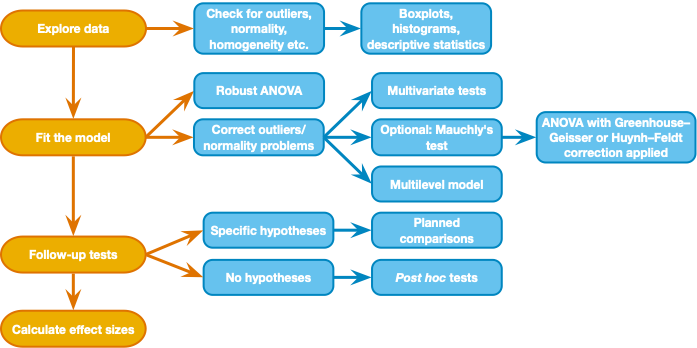

## Repeated Measures Analysis in SPSS  

Bhanji & Lobue - Statistical Methods  
*last updated November 15, 2022*  

------------------------------------------------------------------------

## Goals for today  

Learn how to analyze a repeated measure/logitudinal design:  

-	Within subject 2x4 factorial design, repeated measures ANOVA  

    - use General Linear Model - repeated measures
        
    - Effect size: partial eta-squared    
    
    - post-hoc simple effects and pairwise comparisons with the `EM Means` button  
    

------------------------------------------------------------------------

## Step 1 - Get organized  

- make a folder for today's activity  

- make a "data" folder (inside the project folder)  

- **Download these two files and put them in the data folder- they have the exact same data but in different formats (wide vs long):**  
    1. ["mentalrotation\_bysub_wide.csv"](../data/mentalrotation_bysub_wide.csv)  
    2. ["mentalrotation\_bysub_tidy.csv"](../data/mentalrotation_bysub_tidy.csv)   

------------------------------------------------------------------------

## Step 2 - Import data and check it out  

- This data is from [Ganis and Kievit (2016)](https://doi.org/10.5334/jopd.ai), a replication of the [Shephard and Metzler (1971)](https://doi.org/10.1126/science.171.3972.701).  
- In this study subjects had to mentally rotate a 3D shape and respond whether it was the same or different compared to a reference shape. The angle of rotation was manipulated (within subjects) at 0, 50, 100, and 150 degrees as well as the desired response (whether the shape was actually "same" or "different").  
- Each line in the mentalrotation\_bysub_wide.csv file contains a subject's mean response times (ms) for each of the 8 trial types (4 levels of angle * 2 levels of same/different).  
- Each variable is named accoding to the angle and same/different trial type (e.g., `Angle0_Same`)    
- remember that SPSS requires data to be in a wide format (1 row per subject) so for this SPSS activity we will use just the "mentalrotation\_bysub\_wide.csv" file

#### What to do:
  1. import the "mentalrotation_bysub_wide.csv" file: Open SPSS and use File -\> Import Data-\> CSV or Text Data - **make sure you import the wide format file "mentalrotation\_bysub\_wide.csv"** - now check the variable types and add labels if you wish.  
    
  2. Check the variable type and measure for each variable.  
  
  3. Then get descriptives for each variable. Check the distribution shape and potential outliers for the DV (histogram and boxplot)  
  
  4. Make note of your observations - are there extreme values that you're concerned about? We have plenty of data points so let's not worry too much about the slightly non-normal distributions.    

------------------------------------------------------------------------

## Step 3 - Fit a two-way repeated measures ANOVA model   
{width=50%} 

#### Above is the decision process chart from the Field textbook.  

- We will conduct a two-way repeated measures ANOVA model where response time is explained by `Angle`, `DesiredResponse`, and the interaction of the two factors. In plain words, we are examining whether the time it takes to answer whether a shape is the same or different from a reference shape is influenced by the angle of rotation of the shape from the reference, whether the shape actually is the same or different, and whether the effect of angle of rotation depends on whether the shape actually is the same or different.  
- Let's fit the model.  

#### Step 3.1: specify the model  

1. Analyze-\>General Linear Model-\>Repeated Measures      
2. Type `angle` as the first "Within Subject Factor Name", enter "4" for the number of levels, then click "Add"    
3. Type `trialtype` as the second "Within Subject Factor Name" and enter "2" for the number of levels, then click "Add"   
4. Click "Define"  
5. Enter the 8 variable names into the Within-Subjects Variables box in the appropriate places. For example, `Angle0_Different` in level (1,1) and `Angle0_Same` in level (1,2), and so on.   
6. Click Plots, and add a plot with `angle` on the "horizontal axis", and `trialtype` on "Separate Lines".  
7. Click on "EM Means" and add `angle*trialtype` to the "Display means for:" box - choose "Bonferroni" for correction method.  
8. Click on "compare simple main effects" and the Continue   
9. Under "options" check the box for "estimates of effect size"  
10. click OK  

##### Understanding the output  
Output is formatted differently from the between subjects ANOVA, but we still have an F-stat for each term in the model. We will skip the "Multivariate Tests" table (but see textbook sections 15.5 and 15.6 for more info).  

**Mauchly Tests for Sphericity:** 
- Gives a statistical test for violation of sphericity (correlations between pairs of levels are not the same) - for each factor with more than two levels. The Field textbook (section 15.5.2) recommends we ignore this test because it depends upon sample size (like any sig. test). Instead we look at estimates of sphericity (epsilon) in the table and use the appropriate correction for non-sphericity (Greenhouse Geisser is preferred in the textbook for its generality). 
- "Epsilon" gives the epsilon value for the sphericity estimate according to the Greenhouse-Geisser and Huynh-Feldt methods. A value of 1 indicates perfect sphericity and lower values indicate non-sphericity.   
  
**Tests of Within-Subjects Effects (Anova Table):**  
Focus on the Greenhouse-Geisser row for each term in the model (`angle`, `trialtype`, `angle*trialtype`) - this will give the stats after correction for non-sphericity  
  - **F and p-value**: same idea as the F-statistic in between subjects ANOVA, but all variance is within subjects (see Field textbook Chap 15 for more). The basic idea holds that the F-stat is the ratio of variance explained by the model to unexplained variance.   
  - **Partial Eta-squared** - this is an effect size measure for each term in the model. Like eta-squared and R-squared, it represents the proportion of variance in `RT` that is explained by `Angle` ("generalized" to a repeated measures model). But *partial eta-squared* is specific to the within-subjects design (individual differences are not part of error variance). An alternative effect size measure would be generalized eta-squared, which includes individual differences in the error variance, so is not particular to within-subjects designs. Which measure you report depends on whether you want the effect size measure to be comparable across different designs. See [Lakens (2013)](https://dx.doi.org/10.3389%2Ffpsyg.2013.00863) for more discussion. SPSS doesn't provide an easy way to calculate generalized eta-squared but you'll see how to do it in R (and you'll see that the difference in the effect size estimates can be large).        
  
##### Answer the following questions for yourself based on the results:  

1. Is there a significant effect of angle of rotation (on response time)? (define your significance criterion)  
2. Is there a significant effect of trial type (whether the shapes are the same or different)? (define your significance criterion)  
3. Is the effect of angle of rotation significantly moderated by whether the shapes are same or different?  
  
## Step 4 - follow up comparisons to interpret ANOVA results  

So the output suggests that the effect of angle of rotation depends on whether the shapes are same or different (or we can equivalently state that the effect of whether a shape is same or different depends on the angle of rotation). How do we interpret that interaction effect?  
One approach is to look at simple effects with the `EM Means` button (estimated marginal means). Simple effects analysis in a factorial design looks at the effect of one factor at each level of the other factor. Let's look at the effect of `Angle` at each level of `trialtype`, and then the effect of `trialtype ` at each level of `Angle`. We requested these tests earlier by clicking the "EM Means" button. The output is under "Estimated Marginal Means" and we will look specifically at the "Pairwise Comparisons" and "Multivariate Tests" tables here.  

**Pairwise Comparisons:**   
Like we had in the between subjects ANOVA, the output is one row for every comparison between pairs of means. The mean difference is given with confidence interval and (corrected) p-value. We can use these (post-hoc) comparisons to understand the patterns in the data.  

**Multivariate Tests (simple effects tests):**  
There are two of these tables, one for the simple effecs of `angle` at each level of `trialtype`, and another table for simple effects of `trialtype` at each level of `angle`. Each table gives an F-stat and p-value (according to 4 methods that all give the same values). You should be able to see that:    

1.  The simple effect of Angle at each level of DesiredResponse is significant  
2.  The simple effect of DesiredResponse is significant at Angle=0, but not at other levels of Angle  

This pattern is apparent in the plot of means - people are faster to respond to the same image at Angle=0 than a different image at Angle=0, but same/different doesn't matter at Angles greater than 0.  
- We might write up this result like this (paraphrased from Ganis & Kievit (2015)):
*A two-way repeated measures ANOVA with angle of rotation (0, 50, 100, and 150 degrees) and trial type (same, different) as factors showed that RTs were influenced by angle of rotation (F(1.94,102.86) = 193.12, p < .0001, Greenhouse-Geisser correction for non-sphericity, partial η2 = .785). Trial type influenced RTs (F(1,53)=19.72, p<.0001,  partial η2 = .271, and this effect varied by angle of rotation (F(2.68,141.90)=22.27, p < .0001, partial η2 = .30). Simple effects analysis confirmed that angle of rotation increased RTs in both trial type conditions (same: F(3,53) = 81.23, p < .0001; different: F(3,53) = 43.54, p < .001), but the effect of trial type was significant only at the lowest angle of rotation ( angle 0: F(1,53) = 67.391, p <.0001; angle 50: F(1,53) = 2.08, p = 0.154; angle 100: F(1,53) = 2.54, p = 0.117; angle 150: F(1,53) = 0.44, p = 0.509).*  

  
#### Time to go to the [R activity now!](../r_docs/rep-meas-instructions-r.html)

----------------------------------------------------------------------------

## References

- Chapter 15 of Field textbook: Field, A.P. (2018). Discovering Statistics Using IBM SPSS Statistics. 5th Edition. London: Sage.    
- [Ganis, G., & Kievit, R. (2015). A new set of three-dimensional shapes for investigating mental rotation processes: validation data and stimulus set. Journal of Open Psychology Data.](https://doi.org/10.5334/jopd.ai)  
- Lakens, D. (2013). Calculating and reporting effect sizes to facilitate cumulative science: a practical primer for t-tests and ANOVAs. Frontiers in psychology, 4, 863.  

