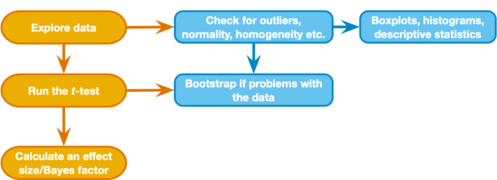

```{r setup, include=FALSE}
knitr::opts_chunk$set(echo = TRUE)
knitr::opts_knit$set(root.dir = rprojroot::find_rstudio_root_file())
library(tidyverse)
library(ggplot2)
```

------------------------------------------------------------------------

## Goals for today  

-	Compare two means from independent groups  
  - use boxplot, histograms to check assumptions  
  - assumptions okay: Independent samples t-test, equal variance assumed or not  
    - Effect size Cohen d (pooled variance)  
  -	assumptions not okay: use nonparametric tests, Wilcoxon rank-sum W, Mann-Whitney U
    - Effect size r (use z-to-r)  
-	Compare two means from dependent samples (e.g., paired samples)  
  - use boxplot, histograms to check assumptions  
  - Effect size Cohen d (use difference between pairs)  
-	Dependent/matched groups: Wilcoxon signed rank test
o	Effect size use z-to-r (Field textbook)


------------------------------------------------------------------------


### Starting off notes  


## Step 1 - Get organized
- **Earlier you downloaded and unzipped [two-group.zip](../../templates/two-group.zip)**   
- Now open RStudio and start a new project, select "Existing Directory" and select the new folder you unzipped as the location    
- In RStudio, open the two-group.Rmd doc inside "r_docs" and do your work in there  
  - run the setup code chunk (the necessary `library()` statements are in there)  
- In the RStudio console, install the packages you'll need today with the install.packages() command:
  - `install.packages("effect_size")`


------------------------------------------------------------------------

## Step 2 - Import data and check it out  

- data description: "AndyField_cloak.csv" is a file created by Dr. Andy Field and part of activities linked to the textbook.  
  - there are three variables: `id`, `cloak`, and `mischief` 
    - `id` stores individual names (students in a magic academy)
    - `cloak` stores whether or not the student has an invisibility cloak ("No cloak" or "Cloak")
    - `mischief` stores the number of mischievious acts committed by each student
- data description: "AndyField_cloak_rm.csv" is a similar file, but each id has two rows: one for each value of `cloak`. So this is a within-subjects version of the experiment where each mischievious acts were measured for each student twice (once while they wore an invisibility cloak, and once while they did not wear a cloak)   

- **What to do first:** Make a new code chunk and use readr::read_csv() to read in the first data file *AndyField_cloak.csv* into a variable called `cloak_tib`. Make sure that NA values are handled the way you want (click on the tibble in the Environment window pane to take a quick look).   
- **What to do next:** make sure the columns that contain nominal vals are treated as nominal, using forcats::as_factor()  *you can look at the solution below*

<button class="btn btn-primary" data-toggle="collapse" data-target="#step-2"> Show/Hide Solution </button>  
<div id="step-2" class="collapse">  
```{r Step-2-import, fig.show='hold', results='hold', message=FALSE}
#first import the data
cloak_tib <- readr::read_csv("data/AndyField_cloak.csv", na = "NA")
# now make sure the columns we want as factors are treated that way, using forcats::as_factor()
cloak_tib <- cloak_tib %>% dplyr::mutate(
  cloak = forcats::as_factor(cloak)
)
```
</div> 
&nbsp;

------------------------------------------------------------------------

## Step 3 - Examine means and distribution  
{width=50%} 

#### Above is the decision process chart from the book.  

- It says we should start by using box plots and histograms to check for unusual cases, non-normality, and possible differences in variance (violation of homogeneity) between groups. let's also make a table of mean, sd, and #cases by group. See if you can use what you learned in previous activities to make
  1. a box plot (group on x-axis)  
  2. a histogram (one for each group, or color-code groups on a single histogram)  
  3. a table of mean, sd, and #cases by group

<button class="btn btn-primary" data-toggle="collapse" data-target="#step-3"> Show/Hide Solution </button>  
<div id="step-3" class="collapse">
```{r Step3a,fig.show='hold', results='hold'}
#box plot
p1 <- cloak_tib %>% 
  ggplot(aes(x = cloak, y = mischief)) + 
    geom_boxplot() +
    theme_classic() + labs(title="Mischief box plot by group", y = "mischief", x = "group")
#histogram
p2 <- cloak_tib %>% 
  ggplot( aes(x=mischief, fill=cloak)) + 
    geom_histogram(position="identity",alpha=.5,binwidth=2) + 
    theme_classic() + labs (title = "Mischief Distribution by group")
#table
cloak_tib %>% group_by(cloak) %>%  
  dplyr::summarise(
    median =  median(mischief,na.rm = TRUE),
    mean =  mean(mischief,na.rm = TRUE),
    sd = sd(mischief,na.rm=TRUE),
    cases = n() - sum(is.na(mischief))
  ) %>% 
    knitr::kable(caption = "Mischief Descriptives by cloak group", digits = 3) %>% 
    kableExtra::kable_styling(full_width = FALSE)
p1; p2
```
</div>
&nbsp;

## Step 4 - Compare means with an independent samples t-test  
- This is a small dataset, but the distributions are basically normal and there are no cases we would consider extreme   
- So let's compare the means of the two groups with an independent samples t-test  
  - use the base R function `t.test()` - you can find the documentation for the function by searching for it in the "Help" tab of your bottom right window pane      
  - when you use the function, specify:
    1. a formula (`mischief ~ cloak`)
    2. the data (`data = cloak_tib`) 
    3. whether you want a two-sided or one-sided test (`alternative = "two.sided"`)
    4. whether you are assuming equal or unequal variance in the groups (`var.equal = FALSE`)
    5. whether the values are independent or paired (`paired = FALSE`)
- Now conduct a two-sided test, assuming unequal variance (unequal variance assumed is the default for this function and is recommended because it is more general and does not compromise statistical power)  
    - look at the solution below and then make it work for you in your Rmd document  

<button class="btn btn-primary" data-toggle="collapse" data-target="#step4"> Show/Hide Solution </button>  
<div id="step4" class="collapse">
```{r Step4, fig.show='hold', results='hold'}
cloak_tib %>% t.test(mischief ~ cloak, data = ., alternative = "two.sided", var.equal = FALSE, paired = FALSE)
# if you prefer, you can pass x an y values like `x = ..., y= ...` instead of using formula notation
```
</div>

### Looking at the t-test summary:  
1. `Welch Two Sample t-test` is the name for an independant samples t-test, allowing for unequal variances in each group  
2. The t-statistic is ratio of the mean difference divided by estimated standard error (essentially the sum of standard error of each mean, though the formula and degrees of freedom are modified to account for unequal variances - see Chapter 10 of the Field textbook), and the p-value tells you the probability of a t-statistic this far from zero under the null hypothesis (notice the degrees of freedom is not an integer - this is due to the modification allowing for unequal variance)
3. The 95% confidence interval gives an estimate of the range of the true difference between means: assuming this sample is one of the 95% that yields a confidence interval containing the population value, we’d conclude that the population difference falls in the given interval  
4. The sample means should match what you saw in your table above  

------------------------------------------------------------------------

## Step 5 - Effect size - independent samples  

In general, effect size estimates for two group comparisons are simply the difference between means expressed in standardized units. This effect size measure is referred to as Cohen's d. As you read in the Lakens article, there are different method's to calculate d. The `effect_size` package can give us these measures - here we will used the pooled variance version of d.

- use `effect_size::cohens_d()` to compute the effect size estimate. you'll need to specify:
  1. a formula, matching your t-test (`mischief ~ cloak`)
  2. the data (`data = cloak_tib`) 
  3. whether you want pooled variance across the groups (`pooled_sd = TRUE`)
  4. whether the values are independent or paired (`paired = FALSE`)

**try it now in your Rmd doc**

<button class="btn btn-primary" data-toggle="collapse" data-target="#step5"> Show/Hide Solution </button>  
<div id="step5" class="collapse">  
```{r Step5,fig.show='hold', results='hold'}
effectsize::cohens_d(mischief ~ cloak, data = cloak_tib, pooled_sd = TRUE, paired = FALSE)
```
</div>
&nbsp;

#### Now, answer the following questions for yourself based on what you've done so far    
1. What is the estimated effect size, and confidence interval for the effect size?
2. What do you conclude about the effect of invisibility cloaks based on this sample of data you have examined?    

------------------------------------------------------------------------

## Step 6 - Dependent samples (also called paired samples, within-subjects comparison, repeated measures)  

Now, let's imagine a different sample of data, where mischief was measured for each individual in two conditions: with or without a cloak. This is a within-subjects or repeated measures design. When we analyze this sample we need to account for the fact that measures in each condition are *dependent*, meaning that the no cloak mischief measure for an individual may be somewhat related to the cloak mischief measure.

**What to do:**
1. read the new sample of data ("AndyField_cloak_rm.csv") into a variable called `cloak_rm_tib`
2. generate a box plot, histogram, and table of means similar to what you did for the first sample (what do you notice?)  

<button class="btn btn-primary" data-toggle="collapse" data-target="#step6a"> Show/Hide Solution </button>  
<div id="step6a" class="collapse">  
```{r Step6a,fig.show='hold', results='hold'}
#first import the data
cloak_rm_tib <- readr::read_csv("data/AndyField_cloak_rm.csv", na = "NA")
# now make sure the columns we want as factors are treated that way, using forcats::as_factor()
cloak_rm_tib <- cloak_rm_tib %>% dplyr::mutate(
  cloak = forcats::as_factor(cloak)
)
#box plot
p1 <- cloak_rm_tib %>% 
  ggplot(aes(x = cloak, y = mischief)) + 
    geom_boxplot() +
    theme_classic() + labs(title="Mischief box plot by condition", y = "mischief", x = "group")
#histogram
p2 <- cloak_rm_tib %>% 
  ggplot( aes(x=mischief, fill=cloak)) + 
    geom_histogram(position="identity",alpha=.5,binwidth=2) + 
    theme_classic() + labs (title = "Mischief Distribution by condition")
#table
cloak_rm_tib %>% group_by(cloak) %>%  
  dplyr::summarise(
    median =  median(mischief,na.rm = TRUE),
    mean =  mean(mischief,na.rm = TRUE),
    sd = sd(mischief,na.rm=TRUE),
    cases = n() - sum(is.na(mischief))
  ) %>% 
    knitr::kable(caption = "Mischief Descriptives by cloak condition", digits = 3) %>% 
    kableExtra::kable_styling(full_width = FALSE)
p1; p2

```
</div>
&nbsp;

- you should see that the means and sd are exactly the same as in the first sample. the difference now is that there are only 12 unique id values (names), and each value has a "cloak" and "no cloak" row  

#### Next, use a paired samples t-test to compare mischief in the "cloak" condition to mischief in the "no cloak" condition  
- use the same `t-test()` function that you ue before, but on the new sample of data, and specify `paired = TRUE`  
- the way R matches pairs of values is by the order they appear in the data, so you should sort the data by id first (use `dplyr::arrange()` - see the solution code for how to do this)  
- **make sure to use the newly imported data (`cloak_rm_tib`), not the first data set (`cloak_tib`)**   

<button class="btn btn-primary" data-toggle="collapse" data-target="#step6b"> Show/Hide Solution </button>  
<div id="step6b" class="collapse">  
```{r Step6b,fig.show='hold', results='hold'}
cloak_rm_tib %>% 
  dplyr::arrange(id) %>%
  t.test(mischief ~ cloak, data = ., paired = TRUE)
```
</div>
&nbsp;

#### If the means and sd are the same, why is the paired comparison different?
- with this design, we are actually have only 12 observations because we are using the difference between `Cloak` and `No cloak` mischief measurements for each student. A paired samples t-test is exactly the same as conducting a 1 sample t-test on the difference between conditions.  
- thus, the t-statistic is still the ratio of the mean difference between conditions divided by estimated standard error, but our estimated standard error is now based on the difference between pairs of values rather than the standard errors for each group  


------------------------------------------------------------------------

## Step 7 - Effect size - dependent samples  

There are a couple ways to think about effect size for this new sample:
  1. effect size should be comparable across studies, thus should not be dependent on the study design (within-subjects).  
    - in this case we should ignore the dependency and compute a pooled variance Cohen's d exactly as we did with the first sample (and get the same value)  
  2. the effect size needs to factor in the dependency between scores in different conditions 
    - in this case we should factor in the correlation between the scores using `paired = TRUE` in our function call
    
Which effect size measure should you use? It depends on your area of study and research question.  Some research questions might be specific to repeated measures designs, and in that case #2 makes sense. But #1 makes sense when you intend the effect size to be comparable across different study designs. The important thing is to be clear about how effect size is calculated when you report it.  

- Now use `effect_size::cohens_d()` to compute the effect size estimate - try it both ways. you'll need to specify:
  1. a formula, matching your t-test (`mischief ~ cloak`)
  2. the data (`data = cloak_tib`) 
  3. whether you want pooled variance across the groups (`pooled_sd = TRUE` for #1, it doesn't matter for #2)
  4. whether the values are independent or paired (`paired = FALSE` for #1 or TRUE for #2)

**try it now in your Rmd doc**

button class="btn btn-primary" data-toggle="collapse" data-target="#step7"> Show/Hide Solution </button>  
<div id="step7" class="collapse">  
```{r Step7,fig.show='hold', results='hold'}
#1
cat("#1 - pooled variance, independent\n")
effectsize::cohens_d(mischief ~ cloak, data = cloak_rm_tib, pooled_sd = TRUE, paired = FALSE)
#2
cat("\n\n#2 - dependent\n")
effectsize::cohens_d(mischief ~ cloak, data = cloak_rm_tib, pooled_sd = FALSE, paired = TRUE)

```
</div>
&nbsp;

#### In your notes, write what you conclude about the effect of invisibility cloaks on mischief-making from this second sample 


----------------------------------------------------------------------------

#### That's all for this activity!

----------------------------------------------------------------------------

## References

- Chapters 9, 20 of textbook  
- Field, A.P. (2021). Discovering Statistics Using R and RStudio. Second. London: Sage.